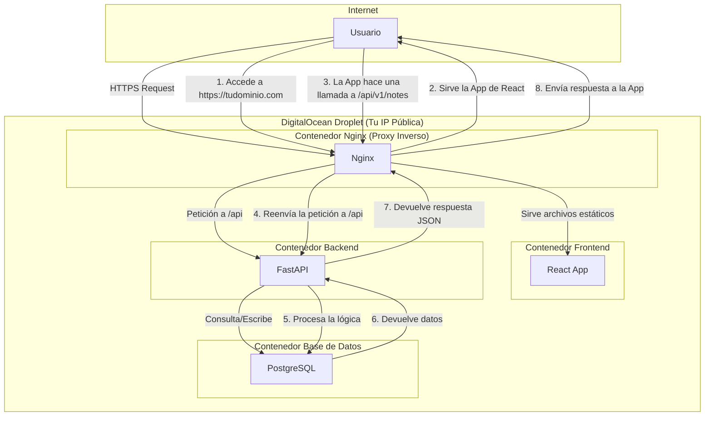

# Arquitectura de Despliegue de Escriba Médico

Este documento describe la arquitectura de red y el flujo de solicitudes para la aplicación Escriba Médico en un entorno de producción.

## Topología de Dominio Único

La aplicación utiliza una arquitectura de **dominio único con enrutamiento basado en la ruta**, lo que simplifica la configuración de DNS, SSL y CORS.

- **Dominio Principal:** `https://tudominio.com`
- **Dirección IP:** Todo el tráfico apunta a la IP única del droplet de DigitalOcean.

### Flujo de Solicitudes

El siguiente diagrama ilustra cómo se manejan las solicitudes de los usuarios:

### Resumen de Rutas

| Ruta Solicitada por el Usuario   | Servicio de Destino   | Propósito                                 |
| -------------------------------- | --------------------- | ----------------------------------------- |
| `https://tudominio.com`          | **Frontend (React)**  | Cargar la interfaz de usuario principal   |
| `https://tudominio.com/assets/*` | **Frontend (React)**  | Servir archivos estáticos (JS, CSS, etc.) |
| `https://tudominio.com/api/*`    | **Backend (FastAPI)** | Gestionar la lógica de negocio, API       |

Esta configuración está definida principalmente en el archivo [`nginx/nginx.conf`](nginx/nginx.conf:1) y orquestada por `docker-compose.yml`.