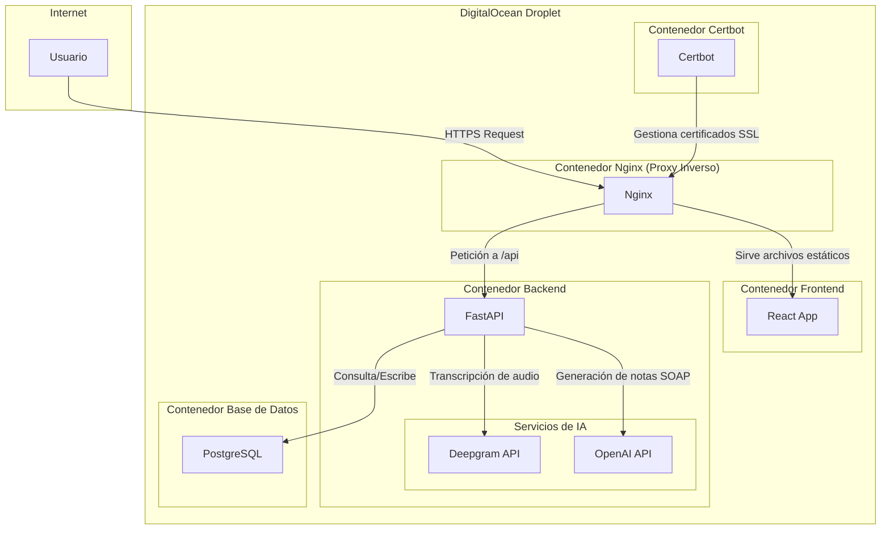
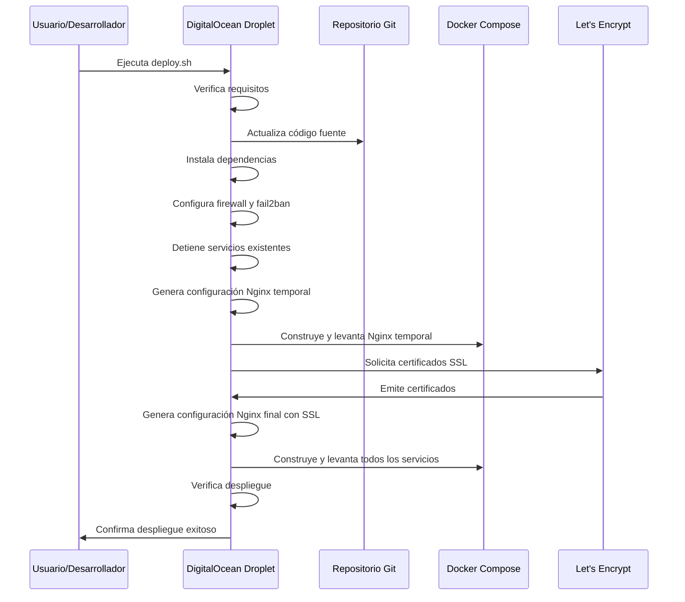

# Informe Técnico: Escriba Médico - Asistente de Documentación Clínica con IA

## 1. Introducción

Escriba Médico (también conocido como Medic Scribe) es una aplicación fullstack diseñada para asistir a médicos en la redacción automática de notas clínicas mediante inteligencia artificial. Su objetivo principal es reducir la carga administrativa y mejorar la calidad de la documentación clínica, permitiendo a los profesionales de la salud enfocarse más en la atención al paciente.

## 2. Tecnologías Utilizadas

### 2.1 Frontend
- **Framework principal**: React con Vite como bundler
- **Lenguaje**: TypeScript
- **Estilos**: TailwindCSS
- **Componentes UI**: shadcn-ui (biblioteca de componentes)
- **Capacidades PWA**: Aplicación web progresiva para uso offline y experiencia móvil mejorada
- **Gestión de estado**: React Query y Context API
- **Routing**: React Router

### 2.2 Backend
- **Framework**: FastAPI (Python 3.12)
- **APIs externas**:
  - Deepgram API (para transcripción de audio)
  - OpenAI API (para procesamiento de lenguaje natural y generación de notas)
- **Procesamiento**: Conversión de audio a texto y generación de notas SOAP

### 2.3 Base de Datos
- **Motor**: PostgreSQL
- **Proveedor**: Supabase (incluye autenticación)

### 2.4 Infraestructura
- **Contenedorización**: Docker y Docker Compose
- **Servidor web/proxy**: Nginx
- **Certificados SSL**: Let's Encrypt con Certbot
- **Despliegue**: DigitalOcean Droplet (VPS)

## 3. Arquitectura de la Aplicación

La aplicación utiliza una arquitectura de microservicios contenerizados, desplegados en un único servidor (DigitalOcean Droplet) y orquestados mediante Docker Compose.

### 3.1 Diagrama de Arquitectura



### 3.2 Flujo de Datos

1. El usuario accede a la aplicación a través de HTTPS (https://tudominio.com)
2. Nginx sirve los archivos estáticos del frontend (React)
3. La aplicación frontend permite grabar audio de consultas médicas
4. El audio se envía al backend a través de la API (/api/transcribe-and-summarize/)
5. El backend utiliza Deepgram para transcribir el audio a texto
6. El texto transcrito se procesa con OpenAI para generar una nota SOAP estructurada
7. La nota generada se devuelve al frontend y se puede guardar en la base de datos
8. El usuario puede editar, guardar y gestionar las notas médicas

### 3.3 Estructura de Dominio Único

La aplicación utiliza una arquitectura de **dominio único con enrutamiento basado en la ruta**, lo que simplifica la configuración de DNS, SSL y CORS.

| Ruta Solicitada por el Usuario   | Servicio de Destino   | Propósito                                 |
| -------------------------------- | --------------------- | ----------------------------------------- |
| `https://tudominio.com`          | **Frontend (React)**  | Cargar la interfaz de usuario principal   |
| `https://tudominio.com/assets/*` | **Frontend (React)**  | Servir archivos estáticos (JS, CSS, etc.) |
| `https://tudominio.com/api/*`    | **Backend (FastAPI)** | Gestionar la lógica de negocio, API       |

## 4. Proceso de Despliegue

El despliegue de la aplicación se realiza mediante un script automatizado (`deploy.sh`) que configura todo el entorno necesario en un DigitalOcean Droplet.

### 4.1 Diagrama del Proceso de Despliegue



### 4.2 Etapas del Despliegue

1. **Preparación del entorno**:
   - Verificación de requisitos (Docker, Docker Compose)
   - Actualización del código fuente desde Git
   - Instalación de dependencias del sistema
   - Configuración de firewall (UFW) y fail2ban

2. **Configuración de SSL**:
   - Generación de configuración Nginx temporal para validación SSL
   - Levantamiento de Nginx temporal
   - Solicitud de certificados SSL a Let's Encrypt
   - Generación de configuración Nginx final con SSL

3. **Despliegue de la aplicación**:
   - Construcción de imágenes Docker
   - Levantamiento de todos los servicios con Docker Compose
   - Verificación del despliegue

### 4.3 Configuración de Docker Compose

La aplicación utiliza Docker Compose para orquestar los siguientes servicios:

1. **db**: Base de datos PostgreSQL
2. **backend**: API FastAPI
3. **frontend**: Aplicación React (solo para construcción)
4. **nginx**: Servidor web y proxy inverso
5. **certbot**: Gestión de certificados SSL

## 5. Problemas con Nginx y Soluciones

### 5.1 Problema Principal

El despliegue estaba fallando durante la fase de solicitud de certificados SSL debido a un desajuste en cómo se estructuraban y montaban las configuraciones de Nginx en los contenedores Docker:

1. La configuración de Nginx se montaba en `/etc/nginx/nginx.conf` (archivo de configuración principal)
2. Sin embargo, certbot y las prácticas estándar de Nginx esperan que las configuraciones de sitios estén en `/etc/nginx/conf.d/default.conf`
3. Este desajuste causaba que la solicitud de certificados SSL fallara

### 5.2 Solución Implementada

Se reestructuró la configuración de Nginx para seguir las prácticas estándar:

1. **Actualización de la configuración de Docker Compose**:
   ```yaml
   volumes:
     # Montar la configuración específica del sitio en la ubicación estándar
     - ./nginx/generated_nginx.conf:/etc/nginx/conf.d/default.conf
     # Agregar un nginx.conf base que incluye conf.d/*.conf
     - ./nginx/base_nginx.conf:/etc/nginx/nginx.conf
   ```

2. **Creación de una configuración base estándar de Nginx**:
   - Se creó `nginx/base_nginx.conf` que sigue la estructura estándar de Nginx
   - Configura parámetros básicos de Nginx
   - Incluye configuraciones del directorio `conf.d`

3. **Actualización de las plantillas de Nginx**:
   - Se modificaron todas las plantillas para ser configuraciones de sitio en lugar de configuraciones completas de Nginx
   - Se eliminaron los bloques `events` y `http` (ahora están en la configuración base)
   - Se mantuvieron solo los bloques `server` y directivas relacionadas

### 5.3 Proceso de Despliegue Mejorado

El despliegue ahora sigue este proceso:

1. El script `deploy.sh` genera una configuración temporal de Nginx para la validación SSL
2. Esta configuración se monta en `/etc/nginx/conf.d/default.conf`
3. La configuración base en `/etc/nginx/nginx.conf` incluye esta configuración de sitio
4. Certbot puede validar correctamente el dominio y emitir certificados
5. Después de obtener los certificados, se genera y despliega la configuración final de Nginx

### 5.4 Beneficios de este Enfoque

1. **Estructura Estándar**: Sigue las mejores prácticas de Nginx para la organización de la configuración
2. **Mejor Compatibilidad**: Funciona perfectamente con certbot y otras herramientas que esperan rutas de configuración estándar de Nginx
3. **Mantenimiento Más Fácil**: Separa la configuración base de Nginx de las configuraciones específicas del sitio
4. **Más Robusto**: Reduce la posibilidad de errores de configuración y fallos de despliegue

## 6. Funcionalidades Principales de la Aplicación

### 6.1 Transcripción y Procesamiento de Audio

La aplicación permite a los médicos grabar consultas médicas y procesarlas automáticamente:

1. El médico selecciona un tipo de nota y comienza a grabar la consulta
2. El audio se envía al backend donde se transcribe usando Deepgram
3. La transcripción se procesa con OpenAI para generar una nota SOAP estructurada
4. La nota generada se devuelve al frontend donde puede ser editada y guardada

### 6.2 Gestión de Pacientes y Notas

La aplicación permite:
- Crear y gestionar perfiles de pacientes
- Asociar notas médicas a pacientes específicos
- Ver el historial de consultas de un paciente
- Editar y formatear notas médicas

### 6.3 Capacidades PWA

La aplicación incluye capacidades de Progressive Web App (PWA):
- Instalación en dispositivos móviles
- Funcionamiento offline parcial
- Experiencia de usuario mejorada en dispositivos móviles

## 7. Conclusiones

Escriba Médico es una aplicación moderna que utiliza tecnologías de vanguardia para resolver un problema real en el ámbito médico: la carga administrativa de documentación clínica. Su arquitectura basada en microservicios contenerizados facilita el despliegue y mantenimiento, mientras que su enfoque en la experiencia de usuario (PWA, interfaz intuitiva) la hace accesible para profesionales médicos.

La solución de los problemas de Nginx demuestra la importancia de seguir las prácticas estándar en la configuración de servidores web, especialmente cuando se integran con servicios como Let's Encrypt para la gestión de certificados SSL.

El proceso de despliegue automatizado garantiza una implementación consistente y reduce los errores humanos, lo que es crucial para mantener la disponibilidad y seguridad de la aplicación en un entorno de producción.