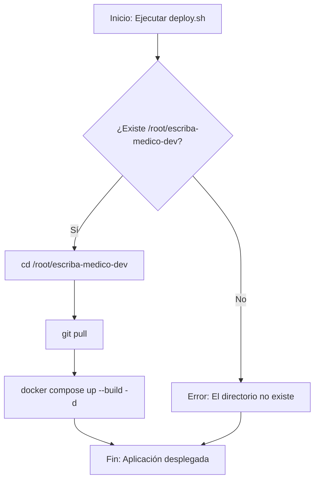

# Plan de Refactorización de Despliegue

Este documento describe el plan para refactorizar la arquitectura de despliegue del proyecto Escriba Médico, simplificando el proceso y centralizando el código fuente en un único directorio.

## 1. Análisis del Problema Actual

La arquitectura de despliegue existente, aunque funcional, presenta las siguientes áreas de mejora:

- **Complejidad innecesaria**: El script [`scripts/deploy.sh`](scripts/deploy.sh) contiene lógica para manejar múltiples escenarios, como la clonación de un repositorio en un directorio temporal y la posterior sincronización con `rsync` ([`scripts/deploy.sh:76-82`](scripts/deploy.sh:76-82)). Esto crea una capa de complejidad que no es necesaria si se establece como pre-requisito que el repositorio ya esté clonado.
- **Directorio de proyecto no estándar**: El uso de `/opt/medic-scribe` ([`scripts/deploy.sh:17`](scripts/deploy.sh:17)) como directorio del proyecto no se alinea con la preferencia de mantener el proyecto en `/root/escriba-medico-dev`.
- **Percepción de duplicación**: El proceso de clonar a un directorio temporal puede ser percibido como una duplicación del código, lo cual se quiere evitar.

## 2. Solución Propuesta

La nueva arquitectura se basará en la simplicidad y en un único punto de verdad para el código fuente.

### Principios Clave:

- **Directorio Único**: Todo el proyecto residirá en `/root/escriba-medico-dev`. Este directorio será un clon directo del repositorio de Git.
- **Pre-requisito**: Se asumirá que el administrador del sistema ha realizado una única clonación inicial del repositorio en la ruta especificada (`git clone [URL_DEL_REPO] /root/escriba-medico-dev`).
- **Actualizaciones con `git pull`**: El script de despliegue se simplificará drásticamente. Su principal responsabilidad respecto al código fuente será ejecutar `git pull` para traer los últimos cambios de la rama principal.
- **Sin duplicación**: Se elimina por completo la clonación en directorios temporales.

### Diagrama del Nuevo Flujo

## 3. Funciones del Nuevo `deploy.sh`

El script `deploy.sh` será modificado para reflejar el nuevo flujo. A continuación se describen sus funciones principales.

| Función                   | Descripción                                                                                                                                                      |
| :------------------------ | :--------------------------------------------------------------------------------------------------------------------------------------------------------------- |
| `log`, `error`, `warning` | Funciones de utilidad para mostrar mensajes con formato en la consola. Se mantienen sin cambios.                                                                 |
| `check_requirements`      | Verifica que el script se ejecute como `root` y que `docker` y `docker-compose` estén instalados. Se mantiene sin cambios.                                       |
| `set_project_dir`         | Navega al directorio `/root/escriba-medico-dev` y verifica que es un repositorio de Git. Falla si el directorio no existe o no es un repositorio válido.         |
| `update_source_code`      | Ejecuta `git pull` para actualizar el código fuente desde el repositorio remoto.                                                                                 |
| `install_dependencies`    | Instala dependencias a nivel de sistema como `ufw`, `fail2ban`, `certbot`. Se mantiene sin cambios.                                                              |
| `configure_firewall`      | Configura las reglas del firewall `UFW` para permitir tráfico SSH, HTTP y HTTPS. Se mantiene sin cambios.                                                        |
| `configure_fail2ban`      | Configura `fail2ban` para proteger el acceso SSH. Se mantiene sin cambios.                                                                                       |
| `stop_existing_services`  | Detiene y elimina los contenedores existentes usando `docker compose down` para asegurar un despliegue limpio.                                                   |
| `deploy_application`      | Ejecuta `docker compose -f compose.prod.yml up --build -d --remove-orphans` para construir las nuevas imágenes (si es necesario) y levantar todos los servicios. |
| `verify_deployment`       | Realiza una comprobación básica para verificar que los contenedores están en ejecución y que la aplicación es accesible a través de su dominio.                  |
| `main`                    | Función principal que orquesta la ejecución de todas las demás funciones en el orden correcto.                                                                   |

Este nuevo enfoque reduce la complejidad, acelera el proceso de despliegue y se alinea con las mejores prácticas de gestión de código fuente en un entorno de producción.