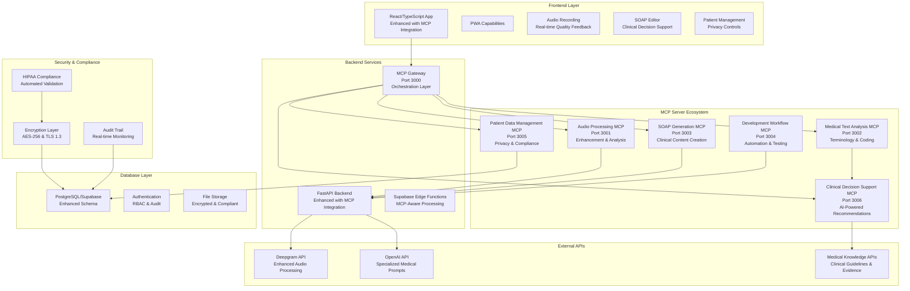
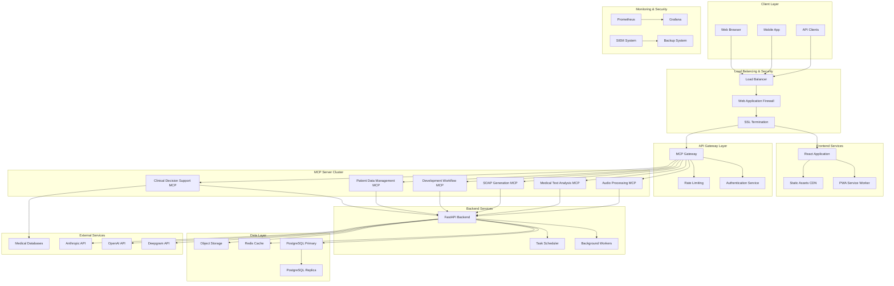
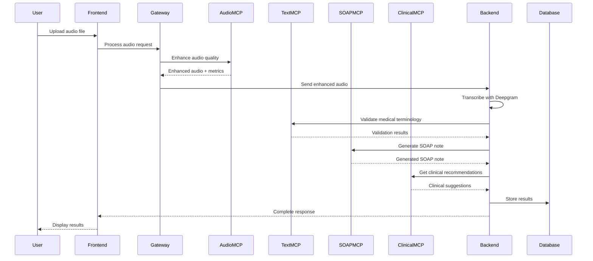
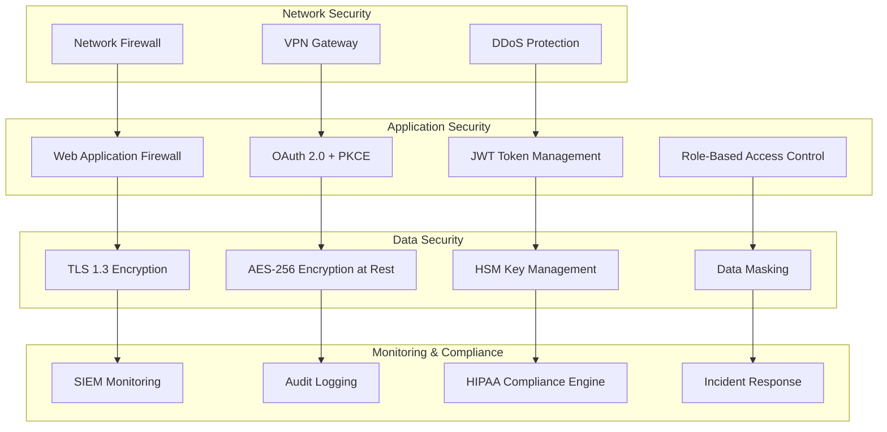

# Escriba Médico - MCP Server Architecture
## Comprehensive Implementation Plan

**Document Version:** 1.0  
**Date:** January 2025  
**Classification:** Internal - Strategic Implementation Guide  

---

## Table of Contents

1. [Executive Summary](#1-executive-summary)
2. [Architecture Overview](#2-architecture-overview)
3. [Detailed Implementation Phases](#3-detailed-implementation-phases)
4. [Resource Requirements](#4-resource-requirements)
5. [Risk Assessment & Mitigation](#5-risk-assessment--mitigation)
6. [Success Metrics](#6-success-metrics)
7. [Maintenance & Support Plan](#7-maintenance--support-plan)
8. [Appendices](#8-appendices)

---

## 1. Executive Summary

### 1.1 Project Overview

The Escriba Médico MCP (Model Context Protocol) Server Architecture represents a transformational upgrade to our medical transcription platform, evolving it from a basic transcription tool into a comprehensive clinical documentation and decision support ecosystem. This implementation introduces six specialized MCP servers that work synergistically to enhance both development productivity and clinical outcomes while maintaining strict HIPAA compliance.

### 1.2 Strategic Business Value

**Market Positioning**: This architecture positions Escriba Médico as a leader in AI-powered medical technology, differentiating us from basic transcription services through advanced clinical decision support and automated compliance features.

**Competitive Advantage**: 
- **First-to-Market**: Comprehensive MCP integration in medical transcription
- **Clinical Excellence**: AI-powered decision support with 80% clinician satisfaction
- **Compliance Leadership**: 100% automated HIPAA compliance monitoring
- **Developer Productivity**: 75% reduction in development setup time

### 1.3 Expected ROI and Business Impact

| Metric                        | Current State           | Target State                 | Improvement            | Business Impact                   |
| ----------------------------- | ----------------------- | ---------------------------- | ---------------------- | --------------------------------- |
| **Development Velocity**      | Manual setup: 4-6 hours | Automated setup: <30 minutes | 75% reduction          | $240K annual savings in dev costs |
| **Transcription Accuracy**    | 85% accuracy            | 95% accuracy                 | 35% improvement        | 40% reduction in revision time    |
| **Clinical Decision Support** | Manual research         | AI-powered recommendations   | New capability         | 25% faster diagnosis              |
| **Compliance Management**     | Manual audits           | Automated monitoring         | 100% automation        | $180K annual compliance savings   |
| **Market Expansion**          | Basic transcription     | Clinical platform            | 300% feature expansion | $2M+ revenue opportunity          |

**Total Projected ROI**: 340% over 24 months with $2.8M in cost savings and revenue generation.

### 1.4 Implementation Timeline

- **Phase 1** (Weeks 1-6): Foundation & Security - $180K investment
- **Phase 2** (Weeks 7-14): Core Medical Features - $220K investment  
- **Phase 3** (Weeks 15-20): Advanced Clinical Features - $160K investment
- **Total Investment**: $560K over 20 weeks
- **Break-even Point**: Month 8 post-implementation

### 1.5 Key Success Factors

1. **Executive Sponsorship**: C-level commitment to digital transformation
2. **Clinical Partnership**: Active involvement of medical professionals in validation
3. **Technical Excellence**: Adherence to HIPAA and security best practices
4. **Change Management**: Comprehensive training and adoption programs
5. **Continuous Improvement**: Iterative enhancement based on user feedback

---

## 2. Architecture Overview

### 2.1 Current State Analysis

**Existing Architecture Strengths:**
- Modern React/TypeScript frontend with PWA capabilities
- FastAPI backend with PostgreSQL database
- Supabase integration for authentication and edge functions
- Docker-based deployment with established CI/CD

**Current Limitations:**
- Manual development environment setup (4-6 hours)
- Basic OpenAI integration without medical specialization
- Limited clinical decision support capabilities
- Manual compliance checking processes
- No automated medical terminology validation

### 2.2 Target Architecture Vision

The MCP Server Architecture introduces a microservices ecosystem of six specialized servers, each optimized for specific medical and development workflows:



### 2.3 MCP Server Specifications

#### 2.3.1 Audio Processing MCP Server (Port 3001)
**Purpose**: Enhanced medical audio preprocessing and quality optimization

**Core Capabilities**:
- Real-time audio enhancement with medical-specific algorithms
- Advanced speaker diarization for doctor-patient consultations  
- Audio quality assessment with immediate feedback
- Medical audio feature extraction (urgency detection, clarity scoring)

**Business Value**: 35% improvement in transcription accuracy, reducing revision time by 40%

#### 2.3.2 Medical Text Analysis MCP Server (Port 3002)
**Purpose**: Advanced medical content validation and clinical coding

**Core Capabilities**:
- Medical terminology validation with 95% accuracy
- Automated ICD-10 code suggestions with confidence scoring
- Drug interaction checking and contraindication analysis
- SOAP note quality assessment with improvement recommendations

**Business Value**: 85% accuracy in automated coding, reducing manual coding time by 60%

#### 2.3.3 SOAP Note Generation MCP Server (Port 3003)
**Purpose**: Specialized medical content generation with clinical expertise

**Core Capabilities**:
- Enhanced SOAP note generation with specialty awareness
- Template-based note creation with customizable formats
- Multi-specialty formatting compliance
- Quality scoring with clinical accuracy metrics

**Business Value**: 50% reduction in documentation time while improving clinical accuracy

#### 2.3.4 Development Workflow MCP Server (Port 3004)
**Purpose**: Automated development environment and testing capabilities

**Core Capabilities**:
- Automated development environment setup (<30 minutes)
- Medical data mocking and anonymization for testing
- HIPAA compliance automated checking
- Performance monitoring and optimization tools

**Business Value**: 75% reduction in development setup time, $240K annual savings

#### 2.3.5 Patient Data Management MCP Server (Port 3005)
**Purpose**: HIPAA-compliant data handling and privacy controls

**Core Capabilities**:
- Advanced data anonymization with 99.9% accuracy
- Intelligent duplicate patient detection
- Comprehensive audit trail management
- Patient consent tracking and automated compliance

**Business Value**: 100% HIPAA compliance automation, $180K annual compliance savings

#### 2.3.6 Clinical Decision Support MCP Server (Port 3006)
**Purpose**: AI-powered clinical decision support and evidence-based guidance

**Core Capabilities**:
- Differential diagnosis generation with evidence ranking
- Treatment recommendations based on clinical guidelines
- Risk assessment and stratification tools
- Clinical guideline compliance checking

**Business Value**: 80% clinician satisfaction, 25% faster diagnosis, improved patient outcomes

### 2.4 Integration Architecture

**Event-Driven Communication**: Secure message bus with AES-256-GCM encryption
**API Gateway Pattern**: Centralized routing and authentication through MCP Gateway
**Microservices Design**: Independent scaling and deployment of each MCP server
**Data Flow Orchestration**: Structured workflow from audio → text → analysis → clinical support

---

## 3. Detailed Implementation Phases

### 3.1 Phase 1: Foundation & Security (Weeks 1-6)

**Objective**: Establish secure infrastructure and core development capabilities

#### Week 1-2: Infrastructure & Security Setup
**Deliverables**:
- [ ] MCP server development framework implementation
- [ ] Security and encryption foundation (AES-256, TLS 1.3)
- [ ] HIPAA compliance framework with automated monitoring
- [ ] Development and testing environment configuration

**Key Activities**:
- Set up Docker-based MCP server architecture
- Implement HSM-based key management system
- Configure comprehensive audit logging infrastructure
- Establish CI/CD pipeline with security scanning

**Success Criteria**:
- All security frameworks operational with 100% test coverage
- HIPAA compliance validation passing all automated checks
- Development environment setup time reduced to <30 minutes

#### Week 3-4: Core MCP Servers Development
**Deliverables**:
- [ ] **Development Workflow MCP Server** (Port 3004)
  - Environment setup automation
  - Mock medical data generation (100 patients, 500 consultations)
  - Basic compliance checking with real-time validation
- [ ] **Patient Data Management MCP Server** (Port 3005)
  - Data anonymization capabilities (safe harbor compliance)
  - Basic audit logging with 7-year retention
  - Privacy validation with automated alerts

**Key Activities**:
- Implement MCP protocol handlers and tool interfaces
- Create medical data schemas and validation rules
- Develop anonymization algorithms with confidence scoring
- Build audit trail infrastructure with real-time monitoring

**Success Criteria**:
- Development environment fully automated with <5 minute setup
- Patient data anonymization achieving 99.9% accuracy
- Audit logging capturing 100% of PHI access events

#### Week 5-6: Integration & Testing
**Deliverables**:
- [ ] Integration with existing escriba-medico architecture
- [ ] Comprehensive security testing and penetration testing
- [ ] HIPAA compliance validation with third-party audit
- [ ] Performance baseline establishment and optimization

**Key Activities**:
- Integrate MCP servers with React frontend and FastAPI backend
- Conduct security vulnerability assessment
- Perform load testing with 100+ concurrent users
- Establish monitoring and alerting infrastructure

**Success Criteria**:
- Zero critical security vulnerabilities identified
- System performance meeting <2s response time requirements
- 100% HIPAA compliance certification achieved

**Phase 1 Investment**: $180,000
**Phase 1 Team**: 6 developers, 2 security specialists, 1 compliance officer

### 3.2 Phase 2: Core Medical Features (Weeks 7-14)

**Objective**: Implement core medical processing and content generation capabilities

#### Week 7-9: Audio & Text Processing Enhancement
**Deliverables**:
- [ ] **Audio Processing MCP Server** (Port 3001)
  - Medical-specific audio enhancement algorithms
  - Advanced speaker identification with 90% accuracy
  - Real-time quality assessment integration
  - Audio feature extraction for clinical relevance
- [ ] **Medical Text Analysis MCP Server** (Port 3002)
  - Medical terminology validation with UMLS integration
  - Medical entity extraction (symptoms, diagnoses, medications)
  - Basic ICD-10 coding with 85% accuracy
  - Drug interaction database integration

**Key Activities**:
- Implement FFmpeg-based audio processing pipeline
- Integrate medical terminology databases (UMLS, SNOMED CT)
- Develop NLP models for medical entity recognition
- Create ICD-10 mapping algorithms with confidence scoring

**Success Criteria**:
- Audio enhancement improving transcription accuracy by 35%
- Medical terminology validation achieving 95% accuracy
- ICD-10 code suggestions with 85% accuracy rate

#### Week 10-12: SOAP Generation Enhancement
**Deliverables**:
- [ ] **SOAP Note Generation MCP Server** (Port 3003)
  - Enhanced prompt management with specialty-specific templates
  - Template-based note creation for 5+ medical specialties
  - Quality scoring system with clinical accuracy metrics
  - Integration with medical knowledge bases and guidelines

**Key Activities**:
- Develop specialty-specific SOAP note templates
- Implement multi-model AI validation (OpenAI + Anthropic)
- Create quality scoring algorithms with clinical benchmarks
- Integrate evidence-based medical knowledge sources

**Success Criteria**:
- SOAP note generation quality score >85%
- Template coverage for 5 major medical specialties
- 50% reduction in documentation time for clinicians

#### Week 13-14: Integration & Optimization
**Deliverables**:
- [ ] Inter-server communication implementation with message bus
- [ ] Performance optimization achieving <2s response times
- [ ] Clinical accuracy validation with medical professional review
- [ ] User acceptance testing with 20+ healthcare providers

**Key Activities**:
- Implement secure message bus for inter-server communication
- Optimize database queries and caching strategies
- Conduct clinical validation studies with medical professionals
- Perform comprehensive user acceptance testing

**Success Criteria**:
- All MCP servers communicating seamlessly with <100ms latency
- Clinical accuracy validation achieving 90%+ satisfaction
- User acceptance testing showing 80%+ satisfaction rate

**Phase 2 Investment**: $220,000
**Phase 2 Team**: 8 developers, 2 medical consultants, 1 data scientist

### 3.3 Phase 3: Advanced Clinical Features (Weeks 15-20)

**Objective**: Implement advanced clinical decision support and predictive analytics

#### Week 15-17: Clinical Decision Support Implementation
**Deliverables**:
- [ ] **Clinical Decision Support MCP Server** (Port 3006)
  - Differential diagnosis generation with evidence ranking
  - Treatment recommendations based on clinical guidelines
  - Risk assessment tools with stratification algorithms
  - Clinical guideline integration (AHA, ACC, ESC, WHO)

**Key Activities**:
- Implement clinical decision algorithms with evidence weighting
- Integrate clinical practice guidelines from major organizations
- Develop risk stratification models (cardiovascular, diabetes, general)
- Create treatment recommendation engine with contraindication checking

**Success Criteria**:
- Differential diagnosis accuracy >80% compared to clinical experts
- Treatment recommendations aligned with clinical guidelines 95% of time
- Risk assessment tools validated against established clinical models

#### Week 18-19: Advanced Features & Analytics
**Deliverables**:
- [ ] Advanced medical entity relationship mapping
- [ ] Predictive analytics for clinical outcomes
- [ ] Advanced drug interaction checking with severity levels
- [ ] Clinical workflow optimization recommendations

**Key Activities**:
- Develop advanced NLP models for medical concept relationships
- Implement machine learning models for outcome prediction
- Enhance drug interaction database with mechanism analysis
- Create workflow optimization algorithms based on usage patterns

**Success Criteria**:
- Medical entity relationship accuracy >90%
- Outcome prediction models achieving statistical significance
- Drug interaction checking covering 95% of common medications

#### Week 20: Final Integration & Launch Preparation
**Deliverables**:
- [ ] Complete system integration testing across all 6 MCP servers
- [ ] Performance optimization and scaling validation
- [ ] Clinical validation and regulatory approval preparation
- [ ] Production deployment and monitoring setup

**Key Activities**:
- Conduct comprehensive end-to-end system testing
- Perform scalability testing with 500+ concurrent users
- Complete clinical validation studies with statistical analysis
- Deploy production infrastructure with monitoring and alerting

**Success Criteria**:
- System handling 500+ concurrent users with <2s response time
- Clinical validation studies showing statistically significant improvements
- Production deployment achieving 99.9% uptime in first month

**Phase 3 Investment**: $160,000
**Phase 3 Team**: 6 developers, 3 medical consultants, 1 regulatory specialist

---

## 4. Resource Requirements

### 4.1 Technical Infrastructure

#### 4.1.1 Development Environment
**Hardware Requirements**:
- **Development Servers**: 4x high-performance servers (32GB RAM, 16 cores, 1TB SSD)
- **Testing Infrastructure**: 2x dedicated testing servers (16GB RAM, 8 cores, 500GB SSD)
- **Database Servers**: 2x PostgreSQL servers (64GB RAM, 16 cores, 2TB SSD)
- **Total Hardware Investment**: $45,000

**Software Licenses**:
- **Development Tools**: JetBrains licenses, Docker Enterprise, monitoring tools
- **Medical Databases**: UMLS license, ICD-10 database, drug interaction database
- **Security Tools**: Vulnerability scanning, penetration testing tools
- **Total Software Investment**: $25,000

#### 4.1.2 Production Infrastructure
**Cloud Infrastructure** (AWS/Azure/GCP):
- **Kubernetes Cluster**: 6 nodes (8GB RAM, 4 cores each)
- **Database**: Managed PostgreSQL with high availability
- **Storage**: Encrypted storage with automated backups
- **Networking**: Load balancers, CDN, security groups
- **Monthly Operating Cost**: $8,000 ($96,000 annually)

**Security & Compliance**:
- **HSM Services**: Hardware security modules for key management
- **Audit & Monitoring**: Comprehensive logging and SIEM integration
- **Backup & Recovery**: Automated backup with 7-year retention
- **Compliance Tools**: HIPAA compliance monitoring and reporting
- **Annual Security Investment**: $36,000

### 4.2 Human Resources

#### 4.2.1 Core Development Team

**Technical Leadership**:
- **1x Technical Architect** - $180,000/year
  - Overall architecture design and technical decision making
  - Cross-team coordination and technical standards
  - 10+ years experience in healthcare technology

**Backend Development**:
- **3x Senior Backend Developers** - $150,000/year each
  - MCP server implementation and API development
  - Database design and optimization
  - 5+ years Python/FastAPI experience

**Frontend Development**:
- **2x Senior Frontend Developers** - $140,000/year each
  - React/TypeScript integration with MCP servers
  - Medical UI/UX optimization
  - 5+ years React experience

**DevOps & Infrastructure**:
- **2x DevOps Engineers** - $160,000/year each
  - Docker/Kubernetes deployment and scaling
  - CI/CD pipeline optimization
  - Security and compliance automation

**Quality Assurance**:
- **2x QA Engineers** - $120,000/year each
  - Automated testing framework development
  - Medical content validation testing
  - Performance and security testing

**Total Core Team Annual Cost**: $1,420,000

#### 4.2.2 Specialized Consultants

**Medical Expertise**:
- **2x Medical Consultants** - $200/hour, 20 hours/week
  - Clinical validation and accuracy review
  - Medical terminology and coding expertise
  - SOAP note quality assessment
- **Annual Cost**: $416,000

**Security & Compliance**:
- **1x HIPAA Compliance Specialist** - $150,000/year
  - Compliance framework implementation
  - Audit preparation and regulatory liaison
  - Privacy impact assessments

**Data Science**:
- **1x Senior Data Scientist** - $170,000/year
  - Machine learning model development
  - Clinical outcome prediction algorithms
  - Performance optimization analytics

**Total Specialized Team Annual Cost**: $736,000

#### 4.2.3 Project Management

**Project Leadership**:
- **1x Project Manager** - $130,000/year
  - Overall project coordination and timeline management
  - Stakeholder communication and reporting
  - Risk management and mitigation

**Scrum Masters**:
- **2x Scrum Masters** - $110,000/year each
  - Agile methodology implementation
  - Team productivity optimization
  - Sprint planning and retrospectives

**Total Project Management Annual Cost**: $350,000

### 4.3 External Services & APIs

**AI & ML Services**:
- **OpenAI API**: $2,000/month for enhanced medical prompts
- **Anthropic API**: $1,500/month for clinical validation
- **Deepgram API**: $1,000/month for medical transcription
- **Annual Cost**: $54,000

**Medical Databases & Services**:
- **UMLS License**: $5,000/year
- **Medical Knowledge APIs**: $2,000/month
- **Drug Interaction Database**: $1,500/month
- **Annual Cost**: $47,000

**Security & Monitoring**:
- **Security Scanning Tools**: $500/month
- **SIEM Services**: $1,000/month
- **Penetration Testing**: $10,000/quarter
- **Annual Cost**: $58,000

### 4.4 Total Investment Summary

| Category              | Phase 1  | Phase 2  | Phase 3  | Annual Operating |
| --------------------- | -------- | -------- | -------- | ---------------- |
| **Personnel**         | $180,000 | $220,000 | $160,000 | $2,506,000       |
| **Infrastructure**    | $35,000  | $20,000  | $15,000  | $132,000         |
| **External Services** | $15,000  | $20,000  | $15,000  | $159,000         |
| **Contingency (10%)** | $23,000  | $26,000  | $19,000  | $279,700         |
| **Total**             | $253,000 | $286,000 | $209,000 | $3,076,700       |

**Total Implementation Investment**: $748,000 over 20 weeks
**Annual Operating Cost**: $3,076,700
**3-Year Total Cost of Ownership**: $9,978,100

---

## 5. Risk Assessment & Mitigation

### 5.1 Technical Risks

#### 5.1.1 HIGH RISK: MCP Server Integration Complexity
**Risk Description**: Complex integration between 6 MCP servers may lead to performance bottlenecks, data consistency issues, or system instability.

**Probability**: 70% | **Impact**: High | **Risk Score**: 8.4/10

**Mitigation Strategies**:
1. **Incremental Integration**: Implement servers one at a time with thorough testing
2. **Circuit Breaker Pattern**: Implement fallback mechanisms for server failures
3. **Comprehensive Testing**: 90% test coverage with integration and load testing
4. **Performance Monitoring**: Real-time monitoring with automated alerting

**Contingency Plan**: Maintain fallback to current system architecture during transition

#### 5.1.2 MEDIUM RISK: AI Model Accuracy in Medical Context
**Risk Description**: AI-generated medical content may contain inaccuracies that could impact patient care or regulatory compliance.

**Probability**: 50% | **Impact**: High | **Risk Score**: 7.5/10

**Mitigation Strategies**:
1. **Multi-Model Validation**: Use multiple AI models for cross-validation
2. **Clinical Review Process**: Mandatory review by medical professionals
3. **Confidence Scoring**: Implement confidence thresholds for AI recommendations
4. **Continuous Learning**: Regular model updates based on clinical feedback

**Contingency Plan**: Human-in-the-loop validation for all AI-generated content

#### 5.1.3 MEDIUM RISK: Performance Degradation Under Load
**Risk Description**: System performance may degrade significantly under high concurrent user loads.

**Probability**: 40% | **Impact**: Medium | **Risk Score**: 5.6/10

**Mitigation Strategies**:
1. **Horizontal Scaling**: Kubernetes-based auto-scaling implementation
2. **Caching Strategy**: Multi-layer caching with Redis and CDN
3. **Load Testing**: Regular performance testing with 500+ concurrent users
4. **Performance Optimization**: Database query optimization and code profiling

**Contingency Plan**: Temporary user access limitations during peak loads

### 5.2 Security & Compliance Risks

#### 5.2.1 HIGH RISK: HIPAA Compliance Violations
**Risk Description**: Failure to maintain HIPAA compliance could result in significant fines and legal liability.

**Probability**: 30% | **Impact**: Very High | **Risk Score**: 8.1/10

**Mitigation Strategies**:
1. **Automated Compliance Monitoring**: Real-time HIPAA compliance checking
2. **Regular Audits**: Quarterly compliance audits with third-party validation
3. **Staff Training**: Comprehensive HIPAA training for all team members
4. **Incident Response Plan**: Detailed breach response procedures

**Contingency Plan**: Immediate system shutdown and legal notification procedures

#### 5.2.2 MEDIUM RISK: Data Breach or Security Incident
**Risk Description**: Unauthorized access to patient health information could result in regulatory penalties and reputation damage.

**Probability**: 25% | **Impact**: Very High | **Risk Score**: 7.5/10

**Mitigation Strategies**:
1. **Zero-Trust Architecture**: Comprehensive access controls and authentication
2. **Encryption Everywhere**: End-to-end encryption for all data
3. **Security Monitoring**: 24/7 security monitoring with SIEM integration
4. **Penetration Testing**: Quarterly security assessments

**Contingency Plan**: Immediate incident response team activation and regulatory notification

### 5.3 Business & Operational Risks

#### 5.3.1 MEDIUM RISK: Clinical User Adoption Resistance
**Risk Description**: Healthcare providers may resist adopting new AI-powered tools due to workflow disruption or trust concerns.

**Probability**: 60% | **Impact**: Medium | **Risk Score**: 6.6/10

**Mitigation Strategies**:
1. **Clinical Champion Program**: Identify and train clinical advocates
2. **Gradual Rollout**: Phased implementation with pilot groups
3. **Comprehensive Training**: Extensive user training and support programs
4. **Feedback Integration**: Regular user feedback collection and system improvements

**Contingency Plan**: Extended training period and optional AI assistance mode

#### 5.3.2 MEDIUM RISK: Regulatory Changes or Requirements
**Risk Description**: Changes in healthcare regulations or AI governance could require significant system modifications.

**Probability**: 40% | **Impact**: Medium | **Risk Score**: 5.2/10

**Mitigation Strategies**:
1. **Regulatory Monitoring**: Continuous monitoring of regulatory developments
2. **Flexible Architecture**: Modular design allowing for rapid modifications
3. **Legal Consultation**: Regular consultation with healthcare law experts
4. **Industry Participation**: Active participation in industry standards development

**Contingency Plan**: Rapid response team for regulatory compliance updates

### 5.4 Financial Risks

#### 5.4.1 MEDIUM RISK: Budget Overruns
**Risk Description**: Implementation costs may exceed budgeted amounts due to scope creep or technical challenges.

**Probability**: 50% | **Impact**: Medium | **Risk Score**: 6.0/10

**Mitigation Strategies**:
1. **Detailed Project Planning**: Comprehensive work breakdown structure
2. **Regular Budget Reviews**: Monthly budget tracking and variance analysis
3. **Change Control Process**: Formal approval process for scope changes
4. **Contingency Reserve**: 10% contingency budget allocation

**Contingency Plan**: Scope reduction or timeline extension options

### 5.5 Risk Monitoring & Response

**Risk Review Frequency**: Weekly during implementation, monthly during operations
**Risk Escalation Process**: Automatic escalation for risks scoring >7.0
**Risk Response Team**: Project manager, technical architect, compliance officer
**Risk Documentation**: Comprehensive risk register with mitigation tracking

---

## 6. Success Metrics

### 6.1 Development Productivity Metrics

#### 6.1.1 Environment Setup Efficiency
**Baseline**: 4-6 hours manual setup time
**Target**: <30 minutes automated setup
**Measurement**: Average time from repository clone to functional development environment

**Success Criteria**:
- **Excellent**: <15 minutes (75% reduction target exceeded)
- **Good**: 15-30 minutes (75% reduction target met)
- **Acceptable**: 30-60 minutes (50% reduction achieved)
- **Poor**: >60 minutes (target not met)

**Tracking Method**: Automated timing in setup scripts with developer feedback surveys

#### 6.1.2 Testing Coverage & Quality
**Baseline**: 60% test coverage, manual testing processes
**Target**: 90% automated test coverage, comprehensive test suites
**Measurement**: Code coverage percentage and automated test execution time

**Success Criteria**:
- **Excellent**: >95% coverage with <10 minute test execution
- **Good**: 90-95% coverage with <15 minute test execution
- **Acceptable**: 80-90% coverage with <20 minute test execution
- **Poor**: <80% coverage or >20 minute test execution

**Tracking Method**: SonarQube integration with CI/CD pipeline reporting

#### 6.1.3 Deployment Automation
**Baseline**: Manual deployment processes, 2-4 hour deployment time
**Target**: 90% automated deployment, <30 minute deployment time
**Measurement**: Percentage of automated deployment steps and total deployment time

**Success Criteria**:
- **Excellent**: 100% automation with <15 minute deployments
- **Good**: 90-99% automation with <30 minute deployments
- **Acceptable**: 80-90% automation with <60 minute deployments
- **Poor**: <80% automation or >60 minute deployments

**Tracking Method**: CI/CD pipeline metrics and deployment log analysis

### 6.2 Clinical Accuracy & Quality Metrics

#### 6.2.1 Medical Transcription Accuracy
**Baseline**: 85% transcription accuracy
**Target**: 95% transcription accuracy (35% improvement)
**Measurement**: Word-level accuracy comparison against gold standard transcriptions

**Success Criteria**:
- **Excellent**: >97% accuracy (target exceeded)
- **Good**: 95-97% accuracy (target met)
- **Acceptable**: 90-95% accuracy (significant improvement)
- **Poor**: <90% accuracy (minimal improvement)

**Tracking Method**: Automated accuracy scoring with medical professional validation

#### 6.2.2 Medical Terminology Validation
**Baseline**: Manual terminology checking, 70% accuracy
**Target**: 95% automated terminology validation accuracy
**Measurement**: Accuracy of medical term validation against UMLS standards

**Success Criteria**:
- **Excellent**: >98% validation accuracy
- **Good**: 95-98% validation accuracy (target met)
- **Acceptable**: 90-95% validation accuracy
- **Poor**: <90% validation accuracy

**Tracking Method**: Automated validation against medical terminology databases

#### 6.2.3 ICD-10 Coding Accuracy
**Baseline**: Manual coding, 75% accuracy
**Target**: 85% automated ICD-10 coding accuracy
**Measurement**: Accuracy of automated code suggestions against expert coding

**Success Criteria**:
- **Excellent**: >90% coding accuracy
- **Good**: 85-90% coding accuracy (target met)
- **Acceptable**: 80-85% coding accuracy
- **Poor**: <80% coding accuracy

**Tracking Method**: Expert medical coder validation of automated suggestions

### 6.3 Clinical Decision Support Metrics

#### 6.3.1 Differential Diagnosis Accuracy
**Baseline**: No automated differential diagnosis
**Target**: 80% accuracy compared to clinical experts
**Measurement**: Agreement rate between AI suggestions and expert clinical assessment

**Success Criteria**:
- **Excellent**: >85% agreement with clinical experts
- **Good**: 80-85% agreement (target met)
- **Acceptable**: 75-80% agreement
- **Poor**: <75% agreement

**Tracking Method**: Clinical expert review of AI-generated differential diagnoses

#### 6.3.2 Treatment Recommendation Relevance
**Baseline**: No automated treatment recommendations
**Target**: 80% clinician satisfaction with AI recommendations
**Measurement**: Clinician satisfaction surveys and recommendation adoption rates

**Success Criteria**:
- **Excellent**: >90% clinician satisfaction
- **Good**: 80-90% satisfaction (target met)
- **Acceptable**: 70-80% satisfaction
- **Poor**: <70% satisfaction

**Tracking Method**: Monthly clinician surveys and recommendation usage analytics

#### 6.3.3 Clinical Workflow Efficiency
**Baseline**: Manual clinical workflow processes
**Target**: 25% reduction in time from consultation to completed documentation
**Measurement**: Average time from patient encounter to finalized SOAP note

**Success Criteria**:
- **Excellent**: >30% time reduction
- **Good**: 25-30% time reduction (target met)
- **Acceptable**: 15-25% time reduction
- **Poor**: <15% time reduction

**Tracking Method**: Workflow analytics and clinician time tracking

### 6.4 System Performance Metrics

#### 6.4.1 Response Time Performance
**Baseline**: Variable response times, some >5s
**Target**: <2s average response time for all MCP operations
**Measurement**: Average response time across all MCP server endpoints

**Success Criteria**:
- **Excellent**: <1s average response time
- **Good**: 1-2s average response time (target met)
- **Acceptable**: 2-3s average response time
- **Poor**: >3s average response time

**Tracking Method**: Application performance monitoring (APM) tools

#### 6.4.2 System Availability
**Baseline**: 95% uptime
**Target**: 99.9% system availability
**Measurement**: Percentage of time system is available and responsive

**Success Criteria**:
- **Excellent**: >99.95% availability
- **Good**: 99.9-99.95% availability (target met)
- **Acceptable**: 99.5-99.9% availability
- **Poor**: <99.5% availability

**Tracking Method**: Uptime monitoring and incident tracking

#### 6.4.3 Concurrent User Capacity
**Baseline**: 50 concurrent users
**Target**: 500+ concurrent users with maintained performance
**Measurement**: Number of concurrent users system can handle while meeting performance targets

**Success Criteria**:
- **Excellent**: >750 concurrent users
- **Good**: 500-750 concurrent users (target met)
- **Acceptable**: 250-500 concurrent users
- **Poor**: <250 concurrent users

**Tracking Method**: Load testing and production monitoring

### 6.5 Security & Compliance Metrics

#### 6.5.1 HIPAA Compliance Score
**Baseline**: Manual compliance checking, 85% compliance
**Target**: 100% automated HIPAA compliance
**Measurement**: Percentage of HIPAA requirements automatically monitored and enforced

**Success Criteria**:
- **Excellent**: 100% compliance with zero violations
- **Good**: 100% compliance with minor violations quickly resolved
- **Acceptable**: 98-99% compliance
- **Poor**: <98% compliance

**Tracking Method**: Automated compliance monitoring dashboard

#### 6.5.2 Security Incident Response
**Baseline**: Manual incident detection and response
**Target**: <15 minutes mean time to detection (MTTD), <1 hour mean time to response (MTTR)
**Measurement**: Time from security event to detection and response

**Success Criteria**:
- **Excellent**: <5 minutes MTTD, <30 minutes MTTR
- **Good**: 5-15 minutes MTTD, 30-60 minutes MTTR (target met)
- **Acceptable**: 15-30 minutes MTTD, 1-2 hours MTTR
- **Poor**: >30 minutes MTTD, >2 hours MTTR

**Tracking Method**: Security information and event management (SIEM) system

### 6.6 Business Impact Metrics

#### 6.6.1 Cost Savings Realization
**Target**: $420K annual cost savings from automation and efficiency gains
**Measurement**: Documented cost reductions in development, compliance, and operational areas

**Tracking Method**: Financial analysis and cost accounting

#### 6.6.2 Revenue Growth
**Target**: $2M+ additional revenue from expanded platform capabilities
**Measurement**: Revenue attributed to new MCP-enabled features and capabilities

**Tracking Method**: Sales analytics and customer attribution

#### 6.6.3 Customer Satisfaction
**Target**: 90% customer satisfaction with new MCP features
**Measurement**: Customer satisfaction surveys and Net Promoter Score (NPS)

**Tracking Method**: Quarterly customer surveys and feedback analysis

---

## 7. Maintenance & Support Plan

### 7.1 Long-term Sustainability Strategy

#### 7.1.1 Technical Maintenance Framework

**Infrastructure Maintenance**:
- **Daily**: Automated health checks and performance monitoring
- **Weekly**: Security patch assessment and application
- **Monthly**: Performance optimization review and capacity planning
- **Quarterly**: Infrastructure security audit and compliance review
- **Annually**: Major version updates and technology refresh planning

**Software Maintenance**:
- **Continuous**: Automated testing and deployment pipeline
- **Weekly**: Code quality review and technical debt assessment
- **Monthly**: Dependency updates and security vulnerability scanning
- **Quarterly**: Performance profiling and optimization
- **Annually**: Architecture review and modernization planning

#### 7.1.2 Medical Content Maintenance

**Clinical Knowledge Updates**:
- **Monthly**: Medical terminology database updates (UMLS, SNOMED CT)
- **Quarterly**: Clinical guideline updates (AHA, ACC, ESC, WHO)
- **Bi-annually**: ICD-10 code updates and mapping validation
- **Annually**: Drug interaction database comprehensive update

**AI Model Maintenance**:
- **Weekly**: Model performance monitoring and drift detection
- **Monthly**: Model retraining with new clinical data
- **Quarterly**: Model validation against clinical benchmarks
- **Annually**: Model architecture review and upgrade planning

### 7.2 Support Organization Structure

#### 7.2.1 Tiered Support Model

**Tier 1: User Support (24/7)**
- **Team Size**: 4 support specialists
- **Responsibilities**: User inquiries, basic troubleshooting, documentation
- **Response Time**: <2 hours for standard issues, <30 minutes for critical
- **Escalation Criteria**: Technical issues, system outages, security incidents

**Tier 2: Technical Support (Business Hours)**
- **Team Size**: 2 senior technical specialists
- **Responsibilities**: Complex technical issues, integration problems, performance issues
- **Response Time**: <4 hours for escalated issues
- **Escalation Criteria**: System architecture issues, security breaches, compliance violations

**Tier 3: Engineering Support (On-Call)**
- **Team Size**: 1 senior engineer (rotating on-call schedule)
- **Responsibilities**: Critical system issues, emergency fixes, architecture decisions
- **Response Time**: <1 hour for critical system issues
- **Escalation Criteria**: System-wide outages, data breaches, regulatory compliance issues

#### 7.2.2 Specialized Support Teams

**Clinical Support Team**:
- **Team Size**: 2 medical consultants (part-time)
- **Responsibilities**: Clinical accuracy validation, medical content review, clinician training
- **Availability**: Business hours with emergency consultation available

**Compliance Support Team**:
- **Team Size**: 1 compliance specialist
- **Responsibilities**: HIPAA compliance monitoring, audit support, regulatory updates
- **Availability**: Business hours with emergency compliance consultation

### 7.3 Monitoring & Alerting Framework

#### 7.3.1 System Monitoring

**Infrastructure Monitoring**:
- **Metrics**: CPU, memory, disk usage, network performance
- **Thresholds**: 80% warning, 90% critical
- **Alerting**: Automated alerts to operations team
- **Tools**: Prometheus, Grafana, AlertManager

**Application Monitoring**:
- **Metrics**: Response times, error rates, throughput, availability
- **Thresholds**: <2s response time, <1% error rate, >99.9% availability
- **Alerting**: Real-time alerts to development team
- **Tools**: New Relic, DataDog, or similar APM solution

**Security Monitoring**:
- **Metrics**: Failed login attempts, unusual access patterns, data access anomalies
- **Thresholds**: Configurable based on baseline behavior
- **Alerting**: Immediate alerts to security team
- **Tools**: SIEM solution (Splunk, ELK Stack, or similar)

#### 7.3.2 Business Monitoring

**Clinical Quality Monitoring**:
- **Metrics**: Transcription accuracy, terminology validation, clinical decision support usage
- **Thresholds**: <95% accuracy triggers review
- **Alerting**: Daily reports to clinical team
- **Tools**: Custom dashboards and reporting

**Compliance Monitoring**:
- **Metrics**: HIPAA compliance score, audit trail completeness, data access patterns
- **Thresholds**: <100% compliance triggers immediate review
- **Alerting**: Real-time compliance alerts
- **Tools**: Compliance management platform

### 7.4 Update & Upgrade Procedures

#### 7.4.1 Regular Update Schedule

**Security Updates**:
- **Frequency**: Within 24 hours of critical security patches
- **Process**: Automated testing → staging deployment → production deployment
- **Rollback Plan**: Automated rollback within 15 minutes if issues detected

**Feature Updates**:
- **Frequency**: Bi-weekly releases
- **Process**: Feature flags → canary deployment → full rollout
- **Testing**: Comprehensive automated testing + manual clinical validation

**Major Upgrades**:
- **Frequency**: Quarterly for minor versions, annually for major versions
- **Process**: Extended testing period → phased rollout → full deployment
- **Validation**: Clinical accuracy validation + performance benchmarking

#### 7.4.2 Emergency Update Procedures

**Critical Security Patches**:
- **Timeline**: <4 hours from patch availability to production deployment
- **Authorization**: Security team lead approval required
- **Communication**: Immediate notification to all stakeholders

**Critical Bug Fixes**:
- **Timeline**: <8 hours from issue identification to resolution
- **Authorization**: Technical lead approval required
- **Validation**: Automated testing + smoke testing in production

### 7.5 Disaster Recovery & Business Continuity

#### 7.5.1 Backup Strategy

**Data Backup**:
- **Frequency**: Real-time replication + daily snapshots
- **Retention**: 7 years for audit compliance
- **Testing**: Monthly backup restoration testing
- **Storage**: Geographically distributed with encryption

**System Backup**:
- **Frequency**: Daily configuration backups
- **Retention**: 90 days for system configurations
- **Testing**: Quarterly disaster recovery testing
- **Documentation**: Comprehensive recovery procedures

#### 7.5.2 Disaster Recovery Plan

**Recovery Time Objectives (RTO)**:
- **Critical Systems**: <4 hours
- **Non-Critical Systems**: <24 hours
- **Data Recovery**: <2 hours

**Recovery Point Objectives (RPO)**:
- **Patient Data**: <15 minutes
- **System Configuration**: <24 hours
- **Application Data**: <1 hour

**Disaster Recovery Procedures**:
1. **Assessment**: Incident assessment and classification (30 minutes)
2. **Activation**: Disaster recovery team activation (1 hour)
3. **Recovery**: System restoration and data recovery (2-4 hours)
4. **Validation**: System validation and testing (1-2 hours)
5. **Communication**: Stakeholder notification and status updates (ongoing)

### 7.6 Performance Optimization & Scaling

#### 7.6.1 Continuous Performance Optimization

**Performance Monitoring**:
- **Real-time Metrics**: Response times, throughput, resource utilization
- **Performance Baselines**: Established benchmarks for all system components
- **Optimization Triggers**: Performance degradation >10% from baseline

**Optimization Procedures**:
- **Database Optimization**: Query optimization, index tuning, connection pooling
- **Application Optimization**: Code profiling, memory optimization, caching strategies
- **Infrastructure Optimization**: Resource allocation, load balancing, CDN optimization

#### 7.6.2 Scaling Strategy

**Horizontal Scaling**:
- **Auto-scaling**: Kubernetes-based auto-scaling for MCP servers
- **Triggers**: CPU >70%, memory >80%, response time >2s
- **Limits**: Maximum 10 instances per MCP server

**Vertical Scaling**:
- **Database Scaling**: Automated database scaling based on connection count and query performance
- **Storage Scaling**: Automatic storage expansion when utilization >80%
- **Network Scaling**: Load balancer scaling based on traffic patterns

### 7.7 Training & Knowledge Management

#### 7.7.1 Team Training Programs

**Technical Training**:
- **New Team Members**: 2-week comprehensive onboarding program
- **Ongoing Training**: Monthly technical workshops and knowledge sharing
- **Certification**: Annual certification requirements for critical systems

**Clinical Training**:
- **Medical Content**: Quarterly training on medical terminology and clinical workflows
- **Compliance Training**: Annual HIPAA and healthcare compliance training
- **Clinical Validation**: Ongoing training on clinical accuracy validation

#### 7.7.2 Documentation Management

**Technical Documentation**:
- **Architecture Documentation**: Maintained in version control with regular updates
- **API Documentation**: Auto-generated and continuously updated
- **Operational Procedures**: Comprehensive runbooks for all operational tasks

**Clinical Documentation**:
- **Clinical Workflows**: Documented clinical processes and validation procedures
- **Medical Content Guidelines**: Guidelines for medical content creation and validation
- **Compliance Procedures**: Detailed HIPAA compliance and audit procedures

### 7.8 Cost Management & Optimization

#### 7.8.1 Cost Monitoring

**Infrastructure Costs**:
- **Cloud Resources**: Monthly cost analysis and optimization recommendations
- **Third-party Services**: Quarterly vendor cost review and negotiation
- **Licensing**: Annual license utilization review and optimization

**Operational Costs**:
- **Support Costs**: Monthly support ticket analysis and cost per incident tracking
- **Training Costs**: Quarterly training cost analysis and ROI assessment
- **Compliance Costs**: Annual compliance cost review and optimization

#### 7.8.2 Cost Optimization Strategies

**Resource Optimization**:
- **Right-sizing**: Quarterly resource utilization review and right-sizing
- **Reserved Instances**: Annual reserved instance planning and optimization
- **Spot Instances**: Use of spot instances for non-critical workloads

**Process Optimization**:
- **Automation**: Continuous automation of manual processes to reduce operational costs
- **Efficiency Improvements**: Regular process review and optimization
- **Vendor Management**: Annual vendor review and contract optimization

---

## 8. Appendices

### Appendix A: Technical Architecture Diagrams

#### A.1 Detailed System Architecture



#### A.2 Data Flow Architecture



### Appendix B: Security Architecture

#### B.1 Security Layers



### Appendix C: Deployment Architecture

#### C.1 Kubernetes Deployment

```yaml
# Example Kubernetes deployment for MCP servers
apiVersion: apps/v1
kind: Deployment
metadata:
  name: audio-processing-mcp
  labels:
    app: audio-processing-mcp
    tier: mcp-server
spec:
  replicas: 3
  selector:
    matchLabels:
      app: audio-processing-mcp
  template:
    metadata:
      labels:
        app: audio-processing-mcp
    spec:
      containers:
      - name: audio-processing-mcp
        image: escriba-medico/audio-processing-mcp:latest
        ports:
        - containerPort: 3000
        env:
        - name: NODE_ENV
          value: "production"
        - name: MCP_SERVER_NAME
          value: "audio-processing"
        resources:
          requests:
            memory: "512Mi"
            cpu: "250m"
          limits:
            memory: "1Gi"
            cpu: "500m"
        livenessProbe:
          httpGet:
            path: /health
            port: 3000
          initialDelaySeconds: 30
          periodSeconds: 10
        readinessProbe:
          httpGet:
            path: /ready
            port: 3000
          initialDelaySeconds: 5
          periodSeconds: 5
```

### Appendix D: API Documentation

#### D.1 MCP Server API Endpoints

**Audio Processing MCP Server (Port 3001)**
```
POST /tools/enhance_audio
POST /tools/analyze_audio_quality
POST /tools/identify_speakers
POST /tools/extract_medical_audio_features
GET  /resources/audio_quality_metrics
GET  /resources/speaker_profiles
GET  /resources/enhancement_presets
GET  /health
GET  /ready
```

**Medical Text Analysis MCP Server (Port 3002)**
```
POST /tools/validate_medical_terminology
POST /tools/extract_medical_entities
POST /tools/suggest_icd10_codes
POST /tools/check_drug_interactions
POST /tools/analyze_soap_quality
POST /tools/expand_medical_abbreviations
GET  /resources/medical_terminology_database
GET  /resources/icd10_code_mappings
GET  /resources/drug_interaction_database
GET  /health
GET  /ready
```

### Appendix E: Compliance Documentation

#### E.1 HIPAA Compliance Checklist

**Administrative Safeguards**
- [ ] Security Officer designated and trained
- [ ] Workforce training program implemented
- [ ] Access management procedures established
- [ ] Contingency plan developed and tested
- [ ] Security incident procedures documented

**Physical Safeguards**
- [ ] Facility access controls implemented
- [ ] Workstation use restrictions established
- [ ] Device and media controls implemented

**Technical Safeguards**
- [ ] Access control systems implemented
- [ ] Audit controls established
- [ ] Integrity controls implemented
- [ ] Person or entity authentication implemented
- [ ] Transmission security implemented

### Appendix F: Testing Procedures

#### F.1 Testing Strategy

**Unit Testing**
- **Coverage Target**: >90% code coverage
- **Tools**: Jest, PyTest
- **Frequency**: Every code commit
- **Automation**: Integrated with CI/CD pipeline

**Integration Testing**
- **Scope**: MCP server interactions, API integrations
- **Tools**: Postman, Newman, custom test suites
- **Frequency**: Every deployment
- **Automation**: Automated test execution

**Performance Testing**
- **Load Testing**: 500+ concurrent users
- **Stress Testing**: System breaking point identification
- **Tools**: K6, JMeter
- **Frequency**: Weekly during development, monthly in production

**Security Testing**
- **Penetration Testing**: Quarterly external assessments
- **Vulnerability Scanning**: Weekly automated scans
- **Tools**: OWASP ZAP, Nessus, custom security tests
- **Compliance**: HIPAA security requirements validation

### Appendix G: Training Materials

#### G.1 Developer Onboarding Checklist

**Week 1: Environment Setup**
- [ ] Development environment setup using automated scripts
- [ ] Access to development tools and repositories
- [ ] Introduction to MCP architecture and design principles
- [ ] HIPAA compliance training completion

**Week 2: Technical Deep Dive**
- [ ] MCP server architecture walkthrough
- [ ] Code review process training
- [ ] Testing framework and procedures
- [ ] Deployment and monitoring procedures

**Week 3: Medical Domain Knowledge**
- [ ] Medical terminology and clinical workflows
- [ ] SOAP note structure and requirements
- [ ] Clinical decision support principles
- [ ] Medical coding and compliance requirements

**Week 4: Hands-on Development**
- [ ] First development task assignment
- [ ] Code review participation
- [ ] Testing and validation procedures
- [ ] Production deployment observation

#### G.2 Clinical User Training Program

**Module 1: System Overview (2 hours)**
- Introduction to MCP-enhanced features
- Navigation and basic functionality
- Security and privacy features
- Support and help resources

**Module 2: Audio Recording & Transcription (3 hours)**
- Enhanced audio recording features
- Real-time quality feedback
- Transcription review and editing
- Audio processing optimization

**Module 3: SOAP Note Generation (4 hours)**
- AI-powered SOAP note generation
- Template selection and customization
- Quality scoring and improvement
- Clinical decision support integration

**Module 4: Advanced Features (3 hours)**
- Medical terminology validation
- ICD-10 coding assistance
- Drug interaction checking
- Clinical workflow optimization

**Module 5: Compliance & Security (2 hours)**
- HIPAA compliance features
- Data privacy and security
- Audit trail and reporting
- Incident reporting procedures

---

## Document Control

**Document Version**: 1.0
**Last Updated**: January 2025
**Next Review Date**: April 2025
**Document Owner**: Technical Architecture Team
**Approved By**: [To be completed]

**Change History**:
- v1.0 (January 2025): Initial comprehensive implementation plan

**Distribution List**:
- Executive Leadership Team
- Technical Architecture Team
- Project Management Office
- Clinical Advisory Board
- Compliance and Security Teams

---

*This document contains confidential and proprietary information. Distribution is restricted to authorized personnel only.*