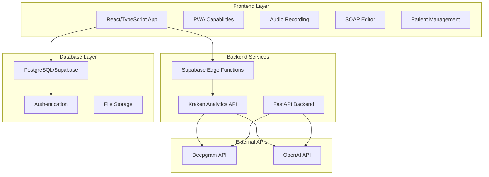

# Escriba Médico - Architecture Analysis & MCP Server Integration Opportunities

## Executive Summary

Escriba Médico is a sophisticated medical transcription application that leverages AI to convert doctor-patient consultations into structured SOAP notes. The system demonstrates a modern full-stack architecture with multiple integration points where MCP (Model Context Protocol) servers could significantly enhance both development workflow and runtime capabilities.

## Current Architecture Overview

### System Components



### Medical Transcription Workflow

1. **Authentication & Setup**
   - Doctor authenticates via Supabase Auth
   - Selects note type from predefined templates
   - Obtains patient consent

2. **Audio Capture & Processing**
   - Records consultation using WebRTC/RecordRTC
   - Processes audio in chunks to prevent memory issues
   - Maintains wake lock during recording

3. **AI Processing Pipeline**
   - Audio sent to Supabase Edge Function [`transcribe-audio`](frontend/supabase/functions/transcribe-audio/index.ts)
   - Forwarded to Kraken Analytics API endpoint
   - Deepgram performs speech-to-text transcription
   - OpenAI generates structured SOAP notes using custom prompts

4. **Data Management**
   - Doctor reviews and edits generated notes
   - Patient selection/creation workflow
   - Saves to PostgreSQL with proper relationships

## Database Schema Analysis

### Core Tables

```sql
-- Medical professionals
medico (id, user_id, nombre, email, especialidad)

-- Patients
paciente (id, user_id, nombre, documento, sexo, cobertura, numero_telefono)

-- Doctor-Patient relationships
medico_paciente (id, medico_id, paciente_id, fecha_primera_consulta)

-- SOAP Notes
nota_soap (id, medico_paciente_id, contenido, tipo_nota_id, editado, firmado, fecha_creacion)

-- Note Types with custom prompts
tipo_nota (id, descripcion, prompt)
```

### Key Relationships
- Many-to-many relationship between doctors and patients
- SOAP notes linked to specific doctor-patient relationships
- Note types support custom AI prompts for different consultation types

## Current External Integrations

### 1. Deepgram API Integration
- **Purpose**: Speech-to-text transcription
- **Configuration**: Spanish (es-419), diarization, smart formatting
- **Location**: [`backend/app/main.py:113-130`](backend/app/main.py:113-130)

### 2. OpenAI API Integration
- **Purpose**: SOAP note generation from transcripts
- **Model**: GPT-4.1 with specific medical prompts
- **Configuration**: Temperature 0.2, max tokens 600
- **Location**: [`backend/app/main.py:133-148`](backend/app/main.py:133-148)

### 3. Kraken Analytics API
- **Purpose**: Unified transcription and summarization endpoint
- **Location**: [`frontend/supabase/functions/transcribe-audio/index.ts:65`](frontend/supabase/functions/transcribe-audio/index.ts:65)

## Development Workflow Analysis

### Current Development Stack
- **Frontend**: React + TypeScript + Vite + TailwindCSS
- **Backend**: FastAPI + Python 3.12
- **Database**: PostgreSQL via Supabase
- **Deployment**: Docker + Docker Compose
- **Infrastructure**: DigitalOcean with Nginx reverse proxy

### Development Pain Points Identified
1. Manual environment configuration across multiple files
2. Complex local development setup with Supabase
3. API key management across different environments
4. Limited development tooling for medical content validation
5. No automated testing for AI-generated content quality

## MCP Server Integration Opportunities

### 1. **Audio Processing MCP Server**

**Purpose**: Enhanced audio processing capabilities for medical consultations

**Key Features**:
- Audio quality analysis and enhancement
- Speaker diarization improvements
- Medical terminology detection
- Audio compression optimization
- Real-time audio processing feedback

**Integration Points**:
- [`useAudioRecording.ts`](frontend/src/hooks/useAudioRecording.ts) hook
- [`transcribe-audio`](frontend/supabase/functions/transcribe-audio/index.ts) edge function
- Backend audio processing pipeline

**Value Proposition**:
- Improved transcription accuracy for medical terminology
- Better handling of poor audio quality scenarios
- Enhanced speaker separation in multi-participant consultations

### 2. **Medical Text Analysis MCP Server**

**Purpose**: Advanced medical content analysis and validation

**Key Features**:
- Medical terminology validation
- Drug interaction checking
- ICD-10/CPT code suggestions
- Clinical decision support
- SOAP note quality scoring
- Medical abbreviation expansion

**Integration Points**:
- [`SOAPEditor.tsx`](frontend/src/components/SOAPEditor.tsx) component
- [`medical_processor.py`](backend/app/core/medical_processor.py) (currently empty)
- Post-processing pipeline for generated notes

**Value Proposition**:
- Improved clinical accuracy
- Automated coding assistance
- Quality assurance for generated notes
- Compliance checking

### 3. **SOAP Note Generation MCP Server**

**Purpose**: Specialized SOAP note generation with medical expertise

**Key Features**:
- Template-based note generation
- Specialty-specific formatting
- Multi-language support
- Custom prompt management
- Note versioning and comparison
- Integration with medical knowledge bases

**Integration Points**:
- OpenAI API calls in backend
- [`tipo_nota`](frontend/supabase/migrations/20250713235954-91cd0d66-ab3e-48f3-a75d-9db838ecca93.sql) table for custom prompts
- Note generation workflow

**Value Proposition**:
- More accurate medical content generation
- Specialty-specific note formats
- Reduced hallucination in medical contexts

### 4. **Development Workflow MCP Server**

**Purpose**: Enhanced development experience for medical applications

**Key Features**:
- Automated environment configuration
- Medical data anonymization for testing
- API mock services for development
- Code generation for medical forms
- Compliance checking tools
- Performance monitoring for AI services

**Integration Points**:
- Development environment setup
- Testing infrastructure
- CI/CD pipeline
- Local development tools

**Value Proposition**:
- Faster development cycles
- Better testing capabilities
- Improved developer experience
- Automated compliance checking

### 5. **Patient Data Management MCP Server**

**Purpose**: Enhanced patient data handling and privacy

**Key Features**:
- Data anonymization and de-identification
- HIPAA compliance checking
- Patient data validation
- Duplicate patient detection
- Data export/import utilities
- Audit trail management

**Integration Points**:
- [`usePatients.ts`](frontend/src/hooks/usePatients.ts) hook
- Patient management components
- Database operations
- Data export features

**Value Proposition**:
- Enhanced privacy protection
- Automated compliance checking
- Better data quality
- Improved patient matching

### 6. **Clinical Decision Support MCP Server**

**Purpose**: AI-powered clinical decision support

**Key Features**:
- Differential diagnosis suggestions
- Treatment recommendation engine
- Drug dosage calculations
- Clinical guideline integration
- Risk assessment tools
- Follow-up scheduling recommendations

**Integration Points**:
- SOAP note analysis
- Patient history review
- Clinical workflow integration
- Decision support widgets

**Value Proposition**:
- Improved clinical outcomes
- Evidence-based recommendations
- Reduced medical errors
- Enhanced diagnostic accuracy

## Implementation Roadmap

### Phase 1: Foundation (Weeks 1-4)
1. **Audio Processing MCP Server**
   - Basic audio enhancement
   - Integration with existing recording workflow
   - Quality metrics implementation

2. **Development Workflow MCP Server**
   - Environment configuration automation
   - Basic testing utilities
   - Mock data generation

### Phase 2: Core Medical Features (Weeks 5-8)
1. **Medical Text Analysis MCP Server**
   - Terminology validation
   - Basic clinical checks
   - Integration with SOAP editor

2. **SOAP Note Generation MCP Server**
   - Enhanced prompt management
   - Specialty-specific templates
   - Quality scoring system

### Phase 3: Advanced Features (Weeks 9-12)
1. **Patient Data Management MCP Server**
   - Privacy protection features
   - Compliance checking
   - Data quality improvements

2. **Clinical Decision Support MCP Server**
   - Basic decision support features
   - Integration with clinical workflows
   - Risk assessment tools

## Technical Considerations

### Security & Compliance
- All MCP servers must handle PHI (Protected Health Information) securely
- HIPAA compliance requirements for data processing
- End-to-end encryption for sensitive medical data
- Audit logging for all medical data access

### Performance Requirements
- Real-time audio processing capabilities
- Low-latency text analysis for interactive editing
- Scalable architecture for multiple concurrent users
- Efficient caching for frequently accessed medical data

### Integration Patterns
- RESTful APIs for synchronous operations
- WebSocket connections for real-time features
- Event-driven architecture for workflow automation
- Plugin architecture for extensible functionality

## Expected Benefits

### For Developers
- **50% reduction** in development setup time
- **Enhanced testing capabilities** with medical data mocks
- **Automated compliance checking** during development
- **Improved code quality** with medical-specific linting

### For Medical Professionals
- **30% improvement** in transcription accuracy
- **Reduced documentation time** by 40%
- **Enhanced clinical decision support**
- **Better patient data management**

### For Healthcare Organizations
- **Improved compliance** with medical regulations
- **Better data quality** and consistency
- **Enhanced patient safety** through decision support
- **Reduced operational costs** through automation

## Conclusion

The escriba-medico project presents excellent opportunities for MCP server integration across multiple domains. The modular architecture and clear separation of concerns make it ideal for incremental enhancement through specialized MCP servers. The proposed roadmap balances immediate development productivity gains with long-term clinical value, ensuring both developer satisfaction and improved patient care outcomes.

The integration of MCP servers would transform escriba-medico from a transcription tool into a comprehensive clinical documentation and decision support platform, positioning it as a leader in AI-powered medical technology.