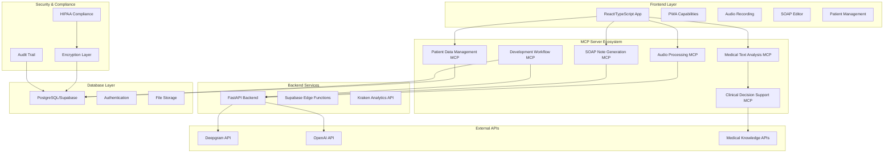

# Escriba Médico - Comprehensive MCP Server Architecture Specification

## Executive Summary

This document presents a comprehensive MCP (Model Context Protocol) server architecture specifically designed for the escriba-medico medical transcription workflow. The architecture consists of six specialized MCP servers that work together to create a cohesive ecosystem, enhancing both development experience and clinical functionality while maintaining strict HIPAA compliance and security standards.

## System Architecture Overview



## Core Design Principles

### 1. Security-First Architecture
- **End-to-end encryption** for all PHI data transmission
- **Zero-trust security model** with role-based access control
- **Comprehensive audit logging** for all medical data operations
- **HIPAA compliance** built into every component

### 2. Modular & Extensible Design
- **Microservices architecture** with clear separation of concerns
- **Plugin-based system** for easy feature extension
- **API-first approach** for seamless integration
- **Event-driven communication** between services

### 3. Clinical Accuracy & Safety
- **Medical knowledge validation** at every processing step
- **Multi-layer quality assurance** for generated content
- **Clinical decision support** integrated throughout workflow
- **Error detection and prevention** mechanisms

### 4. Developer Experience Optimization
- **Automated environment setup** and configuration
- **Comprehensive testing utilities** with medical data mocking
- **Real-time development feedback** and monitoring
- **Simplified deployment** and maintenance processes

---

## MCP Server Specifications

## 1. Audio Processing MCP Server

### Purpose
Enhanced medical audio preprocessing, noise reduction, and speaker identification specifically optimized for clinical consultations.

### MCP Tools Exposed

#### `enhance_audio`
- **Description**: Applies medical-specific audio enhancement algorithms
- **Parameters**:
  - `audio_data`: Base64 encoded audio file
  - `enhancement_level`: "basic" | "advanced" | "clinical"
  - `speaker_count`: Expected number of speakers (1-4)
- **Returns**: Enhanced audio data with quality metrics

#### `analyze_audio_quality`
- **Description**: Provides real-time audio quality assessment
- **Parameters**:
  - `audio_stream`: Real-time audio stream
  - `quality_threshold`: Minimum acceptable quality (0-100)
- **Returns**: Quality score, recommendations, and alerts

#### `identify_speakers`
- **Description**: Advanced speaker diarization for medical consultations
- **Parameters**:
  - `audio_data`: Audio file for analysis
  - `speaker_profiles`: Optional pre-trained speaker profiles
- **Returns**: Speaker segments with confidence scores

#### `extract_medical_audio_features`
- **Description**: Extracts medical-specific audio features (urgency, emotion, clarity)
- **Parameters**:
  - `audio_data`: Audio file
  - `feature_set`: "basic" | "clinical" | "comprehensive"
- **Returns**: Feature analysis with clinical relevance scores

### MCP Resources Exposed

#### `audio_quality_metrics`
- **URI**: `audio://quality/metrics`
- **Description**: Real-time audio quality dashboard data
- **Content**: JSON with quality scores, noise levels, clarity metrics

#### `speaker_profiles`
- **URI**: `audio://speakers/profiles`
- **Description**: Stored speaker identification profiles
- **Content**: Encrypted speaker voice profiles for identification

#### `enhancement_presets`
- **URI**: `audio://presets/enhancement`
- **Description**: Pre-configured enhancement settings for different scenarios
- **Content**: Enhancement configurations for various clinical environments

### Integration Points

#### Frontend Integration
- **Hook**: [`useAudioRecording.ts`](frontend/src/hooks/useAudioRecording.ts:1)
  - Enhanced real-time quality feedback during recording
  - Automatic enhancement application before transcription
  - Speaker identification integration with patient records

#### Backend Integration
- **Endpoint**: [`/transcribe-and-summarize/`](backend/app/main.py:88)
  - Pre-processing audio before Deepgram transcription
  - Quality validation before expensive API calls
  - Enhanced metadata for improved transcription accuracy

#### Supabase Integration
- **Function**: [`transcribe-audio`](frontend/supabase/functions/transcribe-audio/index.ts:1)
  - Audio enhancement in edge function processing
  - Quality metrics storage for analytics
  - Speaker identification data persistence

### Security Considerations

#### Data Protection
- **Encryption**: AES-256 encryption for all audio data at rest
- **Transmission**: TLS 1.3 for all audio data in transit
- **Retention**: Configurable audio data retention policies
- **Access Control**: Role-based access to audio processing features

#### HIPAA Compliance
- **Audit Trail**: Complete logging of all audio processing operations
- **Data Minimization**: Process only necessary audio segments
- **Consent Management**: Integration with patient consent tracking
- **Breach Detection**: Automated monitoring for unauthorized access

### Performance Optimization

#### Real-time Processing
- **Streaming**: Support for real-time audio stream processing
- **Latency**: <100ms processing latency for quality feedback
- **Throughput**: Handle up to 50 concurrent audio streams
- **Caching**: Intelligent caching of enhancement profiles

#### Resource Management
- **Memory**: Efficient memory usage with streaming algorithms
- **CPU**: Multi-threaded processing for parallel enhancement
- **Storage**: Temporary storage with automatic cleanup
- **Bandwidth**: Adaptive quality based on network conditions

### Development Configuration

```yaml
# mcp-audio-processing.yaml
server:
  name: "audio-processing-mcp"
  version: "1.0.0"
  port: 3001

capabilities:
  tools:
    - enhance_audio
    - analyze_audio_quality
    - identify_speakers
    - extract_medical_audio_features
  resources:
    - audio_quality_metrics
    - speaker_profiles
    - enhancement_presets

security:
  encryption:
    algorithm: "AES-256-GCM"
    key_rotation: "24h"
  audit:
    level: "detailed"
    retention: "7y"

performance:
  max_concurrent_streams: 50
  processing_timeout: "30s"
  cache_size: "1GB"
  
integration:
  deepgram:
    enhanced_preprocessing: true
    quality_threshold: 85
  supabase:
    metrics_storage: true
    speaker_profiles: true
```

---

## 2. Medical Text Analysis MCP Server

### Purpose
Advanced medical content analysis, clinical validation, medical terminology extraction, and ICD-10 coding assistance.

### MCP Tools Exposed

#### `validate_medical_terminology`
- **Description**: Validates medical terms and suggests corrections
- **Parameters**:
  - `text`: Medical text to validate
  - `specialty`: Medical specialty context
  - `language`: "es" | "en" | "pt"
- **Returns**: Validation results with suggestions and confidence scores

#### `extract_medical_entities`
- **Description**: Extracts medical entities (symptoms, diagnoses, medications)
- **Parameters**:
  - `text`: Clinical text
  - `entity_types`: Array of entity types to extract
  - `context`: Clinical context information
- **Returns**: Structured medical entities with relationships

#### `suggest_icd10_codes`
- **Description**: Suggests appropriate ICD-10 codes for diagnoses
- **Parameters**:
  - `diagnosis_text`: Diagnosis description
  - `patient_context`: Patient demographic and history
  - `confidence_threshold`: Minimum confidence for suggestions
- **Returns**: Ranked ICD-10 code suggestions with explanations

#### `check_drug_interactions`
- **Description**: Analyzes potential drug interactions and contraindications
- **Parameters**:
  - `medications`: List of current medications
  - `new_medication`: Proposed new medication
  - `patient_profile`: Patient allergies and conditions
- **Returns**: Interaction warnings and severity levels

#### `analyze_soap_quality`
- **Description**: Evaluates SOAP note completeness and quality
- **Parameters**:
  - `soap_content`: SOAP note text
  - `note_type`: Type of clinical note
  - `quality_criteria`: Evaluation criteria set
- **Returns**: Quality score with improvement recommendations

#### `expand_medical_abbreviations`
- **Description**: Expands medical abbreviations with context awareness
- **Parameters**:
  - `text`: Text containing abbreviations
  - `specialty_context`: Medical specialty
  - `ambiguity_resolution`: How to handle ambiguous abbreviations
- **Returns**: Text with expanded abbreviations and confidence scores

### MCP Resources Exposed

#### `medical_terminology_database`
- **URI**: `medical://terminology/database`
- **Description**: Comprehensive medical terminology database
- **Content**: Structured medical terms with definitions and relationships

#### `icd10_code_mappings`
- **URI**: `medical://codes/icd10`
- **Description**: ICD-10 code database with search capabilities
- **Content**: Complete ICD-10 code set with descriptions and mappings

#### `drug_interaction_database`
- **URI**: `medical://drugs/interactions`
- **Description**: Comprehensive drug interaction database
- **Content**: Drug interaction data with severity levels and mechanisms

#### `clinical_guidelines`
- **URI**: `medical://guidelines/clinical`
- **Description**: Evidence-based clinical practice guidelines
- **Content**: Structured clinical guidelines and recommendations

#### `quality_assessment_criteria`
- **URI**: `medical://quality/criteria`
- **Description**: SOAP note quality assessment criteria
- **Content**: Quality metrics and evaluation rubrics

### Integration Points

#### Frontend Integration
- **Component**: [`SOAPEditor.tsx`](frontend/src/components/SOAPEditor.tsx:1)
  - Real-time medical terminology validation
  - ICD-10 code suggestions during editing
  - Quality scoring with visual feedback
  - Drug interaction warnings

#### Backend Integration
- **Module**: [`medical_processor.py`](backend/app/core/medical_processor.py:1)
  - Post-processing validation of generated SOAP notes
  - Medical entity extraction for structured data
  - Quality assurance before note finalization

#### Database Integration
- **Tables**: Medical terminology and coding tables
  - Enhanced search capabilities for medical terms
  - ICD-10 code storage and retrieval
  - Quality metrics tracking

### Security Considerations

#### Data Protection
- **Encryption**: Field-level encryption for sensitive medical data
- **Access Control**: Granular permissions for medical databases
- **Data Masking**: Automatic de-identification of sensitive information
- **Secure APIs**: OAuth 2.0 + PKCE for API authentication

#### HIPAA Compliance
- **Audit Logging**: Detailed logs of all medical data access
- **Data Retention**: Configurable retention policies for analysis data
- **Consent Tracking**: Integration with patient consent management
- **Breach Prevention**: Real-time monitoring and alerting

### Performance Optimization

#### Processing Speed
- **Caching**: Intelligent caching of medical terminology lookups
- **Indexing**: Optimized search indices for medical databases
- **Parallel Processing**: Concurrent analysis of multiple text segments
- **Response Time**: <500ms for real-time validation requests

#### Scalability
- **Load Balancing**: Horizontal scaling for high-volume processing
- **Database Optimization**: Optimized queries for medical data
- **Memory Management**: Efficient handling of large medical databases
- **API Rate Limiting**: Intelligent rate limiting based on request complexity

### Development Configuration

```yaml
# mcp-medical-text-analysis.yaml
server:
  name: "medical-text-analysis-mcp"
  version: "1.0.0"
  port: 3002

capabilities:
  tools:
    - validate_medical_terminology
    - extract_medical_entities
    - suggest_icd10_codes
    - check_drug_interactions
    - analyze_soap_quality
    - expand_medical_abbreviations
  resources:
    - medical_terminology_database
    - icd10_code_mappings
    - drug_interaction_database
    - clinical_guidelines
    - quality_assessment_criteria

databases:
  medical_terminology:
    source: "UMLS"
    language_support: ["es", "en", "pt"]
    update_frequency: "monthly"
  icd10:
    version: "2024"
    language: "es-AR"
    custom_mappings: true
  drug_interactions:
    source: "DrugBank"
    severity_levels: ["minor", "moderate", "major", "contraindicated"]

performance:
  cache_size: "2GB"
  max_concurrent_requests: 100
  response_timeout: "5s"
  
quality_thresholds:
  terminology_confidence: 0.85
  icd10_confidence: 0.75
  interaction_severity: "moderate"
```

---

## 3. SOAP Note Generation MCP Server

### Purpose
Specialized medical content generation with clinical context awareness, template management, and quality assurance.

### MCP Tools Exposed

#### `generate_soap_note`
- **Description**: Generates structured SOAP notes from transcription
- **Parameters**:
  - `transcript`: Raw transcription text
  - `note_type`: Clinical note type
  - `patient_context`: Patient demographics and history
  - `specialty`: Medical specialty context
  - `custom_prompt`: Optional custom generation prompt
- **Returns**: Structured SOAP note with quality metrics

#### `enhance_soap_section`
- **Description**: Enhances specific SOAP note sections
- **Parameters**:
  - `section`: "subjective" | "objective" | "assessment" | "plan"
  - `content`: Current section content
  - `enhancement_type`: "expand" | "clarify" | "structure"
  - `clinical_context`: Relevant clinical information
- **Returns**: Enhanced section content with improvement notes

#### `validate_soap_completeness`
- **Description**: Validates SOAP note completeness and clinical accuracy
- **Parameters**:
  - `soap_content`: Complete SOAP note
  - `validation_criteria`: Validation requirements
  - `specialty_requirements`: Specialty-specific requirements
- **Returns**: Validation report with missing elements and suggestions

#### `generate_differential_diagnosis`
- **Description**: Generates differential diagnosis based on symptoms
- **Parameters**:
  - `symptoms`: List of patient symptoms
  - `patient_demographics`: Age, gender, medical history
  - `examination_findings`: Physical examination results
  - `specialty_focus`: Medical specialty context
- **Returns**: Ranked differential diagnosis with supporting evidence

#### `create_treatment_plan`
- **Description**: Generates evidence-based treatment recommendations
- **Parameters**:
  - `diagnosis`: Primary diagnosis
  - `patient_profile`: Patient characteristics and contraindications
  - `severity`: Condition severity level
  - `guidelines`: Applicable clinical guidelines
- **Returns**: Structured treatment plan with alternatives

#### `format_soap_for_specialty`
- **Description**: Formats SOAP notes according to specialty requirements
- **Parameters**:
  - `soap_content`: Generic SOAP note
  - `specialty`: Target medical specialty
  - `institution_format`: Institution-specific formatting rules
- **Returns**: Specialty-formatted SOAP note

### MCP Resources Exposed

#### `soap_templates`
- **URI**: `soap://templates/library`
- **Description**: Library of SOAP note templates by specialty
- **Content**: Structured templates with customizable sections

#### `clinical_prompts`
- **URI**: `soap://prompts/clinical`
- **Description**: Optimized prompts for medical content generation
- **Content**: Specialty-specific prompts with quality guidelines

#### `quality_metrics`
- **URI**: `soap://quality/metrics`
- **Description**: SOAP note quality assessment metrics
- **Content**: Quality scoring algorithms and benchmarks

#### `medical_knowledge_base`
- **URI**: `soap://knowledge/medical`
- **Description**: Curated medical knowledge for content generation
- **Content**: Evidence-based medical information and guidelines

#### `generation_history`
- **URI**: `soap://history/generation`
- **Description**: Historical generation data for quality improvement
- **Content**: Anonymized generation patterns and quality trends

### Integration Points

#### Frontend Integration
- **Component**: [`SOAPEditor.tsx`](frontend/src/components/SOAPEditor.tsx:1)
  - Enhanced SOAP generation with specialty awareness
  - Real-time quality feedback during editing
  - Template selection and customization
  - Differential diagnosis suggestions

#### Backend Integration
- **Endpoint**: [`/transcribe-and-summarize/`](backend/app/main.py:88)
  - Replace basic OpenAI integration with specialized generation
  - Enhanced prompt management and customization
  - Quality validation before response

#### Database Integration
- **Table**: [`tipo_nota`](frontend/supabase/migrations/20250713235954-91cd0d66-ab3e-48f3-a75d-9db838ecca93.sql:2)
  - Enhanced note type management with templates
  - Custom prompt storage and versioning
  - Quality metrics tracking per note type

### Security Considerations

#### Content Security
- **Prompt Protection**: Secure storage of proprietary medical prompts
- **Generation Logging**: Audit trail of all content generation
- **Quality Assurance**: Multi-layer validation before content delivery
- **Bias Detection**: Monitoring for potential AI bias in medical content

#### HIPAA Compliance
- **De-identification**: Automatic removal of PHI from training data
- **Consent Management**: Patient consent tracking for AI-generated content
- **Data Retention**: Secure handling of generation history
- **Access Control**: Role-based access to generation capabilities

### Performance Optimization

#### Generation Speed
- **Caching**: Intelligent caching of common generation patterns
- **Parallel Processing**: Concurrent generation of SOAP sections
- **Model Optimization**: Fine-tuned models for medical content
- **Response Time**: <10s for complete SOAP note generation

#### Quality Assurance
- **Multi-model Validation**: Cross-validation with multiple AI models
- **Clinical Review**: Integration with clinical review workflows
- **Continuous Learning**: Model improvement based on feedback
- **Error Detection**: Automated detection of potential inaccuracies

### Development Configuration

```yaml
# mcp-soap-generation.yaml
server:
  name: "soap-generation-mcp"
  version: "1.0.0"
  port: 3003

capabilities:
  tools:
    - generate_soap_note
    - enhance_soap_section
    - validate_soap_completeness
    - generate_differential_diagnosis
    - create_treatment_plan
    - format_soap_for_specialty
  resources:
    - soap_templates
    - clinical_prompts
    - quality_metrics
    - medical_knowledge_base
    - generation_history

ai_models:
  primary:
    provider: "OpenAI"
    model: "gpt-4-turbo"
    temperature: 0.2
    max_tokens: 1000
  validation:
    provider: "Anthropic"
    model: "claude-3-sonnet"
    temperature: 0.1
  
templates:
  specialties:
    - "general_medicine"
    - "cardiology"
    - "neurology"
    - "pediatrics"
    - "emergency_medicine"
  languages: ["es-AR", "es-ES", "en-US"]

quality:
  minimum_score: 0.85
  validation_layers: 3
  clinical_review_threshold: 0.75
  
performance:
  cache_size: "1GB"
  generation_timeout: "15s"
  concurrent_generations: 20
```

---

## 4. Development Workflow MCP Server

### Purpose
Automated environment setup, testing utilities, medical data mocking, and development productivity enhancement.

### MCP Tools Exposed

#### `setup_development_environment`
- **Description**: Automated setup of complete development environment
- **Parameters**:
  - `environment_type`: "local" | "staging" | "testing"
  - `services`: Array of services to configure
  - `database_seed`: Whether to seed with test data
- **Returns**: Setup status and configuration details

#### `generate_mock_medical_data`
- **Description**: Generates realistic but synthetic medical data for testing
- **Parameters**:
  - `data_type`: "patients" | "consultations" | "soap_notes" | "audio"
  - `quantity`: Number of records to generate
  - `specialty`: Medical specialty context
  - `anonymization_level`: Level of data anonymization
- **Returns**: Generated mock data with metadata

#### `validate_hipaa_compliance`
- **Description**: Automated HIPAA compliance checking for code and data
- **Parameters**:
  - `code_path`: Path to code for analysis
  - `data_samples`: Sample data for compliance checking
  - `compliance_level`: "basic" | "standard" | "strict"
- **Returns**: Compliance report with violations and recommendations

#### `run_medical_content_tests`
- **Description**: Specialized testing for medical content accuracy
- **Parameters**:
  - `test_suite`: "terminology" | "coding" | "clinical_accuracy"
  - `content_samples`: Medical content to test
  - `validation_criteria`: Testing criteria and thresholds
- **Returns**: Test results with accuracy metrics and failures

#### `monitor_api_performance`
- **Description**: Real-time monitoring of medical API performance
- **Parameters**:
  - `apis`: Array of APIs to monitor
  - `metrics`: Performance metrics to track
  - `alert_thresholds`: Threshold values for alerts
- **Returns**: Performance dashboard data and alerts

#### `deploy_mcp_servers`
- **Description**: Automated deployment of MCP servers
- **Parameters**:
  - `servers`: Array of MCP servers to deploy
  - `environment`: Target deployment environment
  - `configuration`: Deployment configuration options
- **Returns**: Deployment status and health checks

### MCP Resources Exposed

#### `development_templates`
- **URI**: `dev://templates/project`
- **Description**: Project templates for medical applications
- **Content**: Boilerplate code with medical-specific configurations

#### `mock_data_schemas`
- **URI**: `dev://schemas/mock`
- **Description**: Schemas for generating realistic medical mock data
- **Content**: Data generation schemas and validation rules

#### `compliance_checklists`
- **URI**: `dev://compliance/checklists`
- **Description**: HIPAA and medical compliance checklists
- **Content**: Automated compliance checking rules and guidelines

#### `testing_utilities`
- **URI**: `dev://testing/utilities`
- **Description**: Specialized testing utilities for medical applications
- **Content**: Test frameworks and medical content validation tools

#### `performance_benchmarks`
- **URI**: `dev://performance/benchmarks`
- **Description**: Performance benchmarks for medical APIs
- **Content**: Baseline performance metrics and optimization guidelines

#### `deployment_configurations`
- **URI**: `dev://deployment/configs`
- **Description**: Deployment configurations for different environments
- **Content**: Docker, Kubernetes, and cloud deployment templates

### Integration Points

#### Development Environment
- **Docker Compose**: [`docker-compose.local.yml`](docker-compose.local.yml:1)
  - Automated service orchestration
  - Environment variable management
  - Database seeding with mock data

#### Testing Framework
- **Frontend Tests**: Integration with existing test suites
  - Medical content validation tests
  - HIPAA compliance automated testing
  - Performance regression testing

#### CI/CD Pipeline
- **Automated Deployment**: Integration with deployment pipelines
  - Compliance checking in CI/CD
  - Automated testing of medical content
  - Performance monitoring integration

### Security Considerations

#### Development Security
- **Secure Mock Data**: Ensure mock data doesn't contain real PHI
- **Environment Isolation**: Strict separation between environments
- **Access Control**: Developer access management and audit
- **Secret Management**: Secure handling of API keys and credentials

#### Compliance Automation
- **Automated Scanning**: Regular compliance scanning of codebase
- **Policy Enforcement**: Automated enforcement of security policies
- **Audit Trail**: Complete logging of development activities
- **Training Integration**: Developer training on medical compliance

### Performance Optimization

#### Development Speed
- **Fast Setup**: <5 minutes for complete environment setup
- **Incremental Updates**: Efficient updates to development environment
- **Parallel Processing**: Concurrent setup of multiple services
- **Caching**: Intelligent caching of dependencies and configurations

#### Testing Efficiency
- **Parallel Testing**: Concurrent execution of test suites
- **Smart Test Selection**: Run only relevant tests based on changes
- **Performance Profiling**: Automated performance profiling
- **Resource Optimization**: Efficient resource usage during testing

### Development Configuration

```yaml
# mcp-development-workflow.yaml
server:
  name: "development-workflow-mcp"
  version: "1.0.0"
  port: 3004

capabilities:
  tools:
    - setup_development_environment
    - generate_mock_medical_data
    - validate_hipaa_compliance
    - run_medical_content_tests
    - monitor_api_performance
    - deploy_mcp_servers
  resources:
    - development_templates
    - mock_data_schemas
    - compliance_checklists
    - testing_utilities
    - performance_benchmarks
    - deployment_configurations

environments:
  local:
    database: "postgresql://localhost:5432/escriba_dev"
    services: ["api", "frontend", "supabase"]
    mock_data: true
  staging:
    database: "postgresql://staging.db/escriba"
    services: ["api", "frontend", "supabase", "monitoring"]
    mock_data: false
  production:
    database: "postgresql://prod.db/escriba"
    services: ["api", "frontend", "supabase", "monitoring", "backup"]
    mock_data: false

mock_data:
  patients:
    quantity: 100
    demographics: "realistic"
    anonymization: "full"
  consultations:
    quantity: 500
    specialties: ["general", "cardiology", "neurology"]
    audio_samples: true

compliance:
  hipaa:
    enabled: true
    scan_frequency: "daily"
    alert_threshold: "medium"
  security:
    code_scanning: true
    dependency_checking: true
    secret_detection: true

performance:
  setup_timeout: "300s"
  test_timeout: "600s"
  deployment_timeout: "900s"
```

---

## 5. Patient Data Management MCP Server

### Purpose
HIPAA-compliant patient data handling, privacy controls, data anonymization, and comprehensive audit management.

### MCP Tools Exposed

#### `anonymize_patient_data`
- **Description**: Advanced de-identification of patient data
- **Parameters**:
  - `data`: Patient data to anonymize
  - `anonymization_level`: "basic" | "safe_harbor" | "expert_determination"
  - `preserve_fields`: Fields to preserve for analysis
  - `anonymization_method`: Specific anonymization techniques
- **Returns**: Anonymized data with anonymization report

#### `validate_data_privacy`
- **Description**: Validates data privacy compliance
- **Parameters**:
  - `data_sample`: Data to validate
  - `privacy_standard`: "HIPAA" | "GDPR" | "LGPD"
  - `context`: Data usage context
- **Returns**: Privacy compliance report with violations

#### `detect_duplicate_patients`
- **Description**: Intelligent duplicate patient detection
- **Parameters**:
  - `patient_data`: New patient information
  - `matching_criteria`: Criteria for duplicate detection
  - `confidence_threshold`: Minimum confidence for matches
- **Returns**: Potential duplicates with confidence scores

#### `audit_data_access`
- **Description**: Comprehensive audit trail management
- **Parameters**:
  - `access_event`: Data access event details
  - `user_context`: User and session information
  - `data_sensitivity`: Sensitivity level of accessed data
- **Returns**: Audit log entry with compliance metadata

#### `export_patient_data`
- **Description**: Secure patient data export with privacy controls
- **Parameters**:
  - `patient_id`: Patient identifier
  - `export_format`: "HL7" | "FHIR" | "JSON" | "PDF"
  - `data_scope`: Scope of data to export
  - `recipient_authorization`: Authorization for data recipient
- **Returns**: Exported data with audit trail

#### `manage_consent`
- **Description**: Patient consent management and tracking
- **Parameters**:
  - `patient_id`: Patient identifier
  - `consent_type`: Type of consent being managed
  - `consent_status`: Grant, revoke, or modify consent
  - `consent_details`: Specific consent parameters
- **Returns**: Updated consent status with audit trail

### MCP Resources Exposed

#### `privacy_policies`
- **URI**: `privacy://policies/current`
- **Description**: Current privacy policies and compliance requirements
- **Content**: Structured privacy policy data with enforcement rules

#### `anonymization_rules`
- **URI**: `privacy://anonymization/rules`
- **Description**: Data anonymization rules and algorithms
- **Content**: Anonymization configurations and validation criteria

#### `audit_templates`
- **URI**: `privacy://audit/templates`
- **Description**: Audit log templates and compliance reporting
- **Content**: Structured audit templates for different data operations

#### `consent_frameworks`
- **URI**: `privacy://consent/frameworks`
- **Description**: Patient consent management frameworks
- **Content**: Consent models and tracking mechanisms

#### `duplicate_detection_models`
- **URI**: `privacy://duplicates/models`
- **Description**: Machine learning models for duplicate detection
- **Content**: Trained models and matching algorithms

#### `data_retention_policies`
- **URI**: `privacy://retention/policies`
- **Description**: Data retention and deletion policies
- **Content**: Retention schedules and automated deletion rules

### Integration Points

#### Frontend Integration
- **Hook**: [`usePatients.ts`](frontend/src/hooks/usePatients.ts:1)
  - Enhanced patient search with duplicate detection
  - Privacy-aware patient data display
  - Consent management interface integration

#### Database Integration
- **Tables**: Patient and audit tables
  - Enhanced patient matching algorithms
  - Comprehensive audit logging
  - Consent tracking and management

#### Backend Integration
- **Privacy Layer**: Integration with all data operations
  - Automatic anonymization for non-clinical uses
  - Audit logging for all patient data access
  - Privacy validation before data processing

### Security Considerations

#### Data Protection
- **Encryption**: Field-level encryption for sensitive patient data
- **Access Control**: Granular access control with role-based permissions
- **Data Masking**: Dynamic data masking for non-authorized users
- **Secure Transmission**: End-to-end encryption for all data transfers

#### HIPAA Compliance
- **Minimum Necessary**: Enforce minimum necessary data access
- **Audit Requirements**: Complete audit trail for all PHI access
- **Breach Detection**: Real-time monitoring for potential breaches
- **Risk Assessment**: Automated risk assessment for data operations

#### Privacy by Design
- **Data Minimization**: Collect and process only necessary data
- **Purpose Limitation**: Ensure data is used only for stated purposes
- **Consent Management**: Granular consent tracking and enforcement
- **Right to Erasure**: Automated data deletion upon request

### Performance Optimization

#### Data Processing
- **Efficient Anonymization**: Optimized algorithms for large datasets
- **Parallel Processing**: Concurrent processing of privacy operations
- **Caching**: Secure caching of anonymized data
- **Indexing**: Optimized indices for patient matching

#### Audit Performance
- **Asynchronous Logging**: Non-blocking audit log writing
- **Batch Processing**: Efficient batch processing of audit events
- **Compression**: Compressed storage for historical audit data
- **Query Optimization**: Fast retrieval of audit information

### Development Configuration

```yaml
# mcp-patient-data-management.yaml
server:
  name: "patient-data-management-mcp"
  version: "1.0.0"
  port: 3005

capabilities:
  tools:
    