# Medical Scribe Fullstack Architecture

## Overview

The Medical Scribe Fullstack system is a comprehensive medical transcription and SOAP notes management platform designed for healthcare professionals. The system leverages modern containerized architecture, AI services, and cloud infrastructure to provide real-time audio transcription, intelligent SOAP note generation, and secure patient data management.

## C4 Level 2 - Container Diagram

```mermaid
graph TB
    %% External Users
    Doctor[👨‍⚕️ Doctor<br/>Medical Professional]
    
    %% External Systems
    Deepgram[🎤 Deepgram API<br/>Speech-to-Text Service]
    OpenAI[🤖 OpenAI GPT-4.1<br/>SOAP Generation]
    LetsEncrypt[🔒 Let's Encrypt<br/>SSL Certificates]
    
    %% Core System Containers - Dockerized
    subgraph "Docker Compose Stack"
        subgraph "Nginx Layer"
            Nginx[🌐 Nginx Container<br/>Alpine Linux<br/>Reverse Proxy + SSL<br/>Port 80/443]
        end
        
        subgraph "Application Layer"
            Frontend[📱 Frontend Container<br/>React 18.3.1 + TypeScript<br/>Vite Build + Nginx<br/>Multi-stage Dockerfile]
            
            Backend[⚡ Backend Container<br/>FastAPI + Python 3.10<br/>WebSocket Support<br/>Audio Processing]
        end
        
        subgraph "External Services"
            EdgeFunctions[☁️ Supabase Edge Functions<br/>Deno Runtime<br/>transcribe-audio<br/>save-soap-note<br/>get-soap-notes]
            
            Database[(🗄️ Supabase Database<br/>PostgreSQL<br/>Row Level Security<br/>Real-time Subscriptions)]
        end
        
        subgraph "SSL Management"
            Certbot[🔐 Certbot Container<br/>Let's Encrypt<br/>Auto SSL Renewal]
        end
    end
    
    %% Docker Network
    subgraph "Docker Network: medic_scribe_network"
        NetworkInfo[172.20.0.0/16<br/>Backend: 172.20.0.10<br/>Frontend: 172.20.0.20<br/>Nginx: 172.20.0.30]
    end
    
    %% Connections
    Doctor -->|HTTPS/WSS| Nginx
    Nginx -->|HTTP| Frontend
    Nginx -->|HTTP| Backend
    
    Frontend -->|HTTPS| EdgeFunctions
    Frontend -->|WebSocket| Backend
    Frontend -->|HTTPS| Database
    
    EdgeFunctions -->|HTTP| Backend
    EdgeFunctions -->|SQL| Database
    
    Backend -->|HTTPS| Deepgram
    Backend -->|HTTPS| OpenAI
    Backend -->|WebSocket| Frontend
    
    Certbot -->|ACME Challenge| LetsEncrypt
    Nginx -->|SSL Certs| Certbot
    
    %% Styling
    classDef external fill:#e1f5fe
    classDef frontend fill:#f3e5f5
    classDef backend fill:#e8f5e8
    classDef database fill:#fff3e0
    classDef infrastructure fill:#fce4ec
    classDef network fill:#f0f0f0
    
    class Doctor,Deepgram,OpenAI,LetsEncrypt external
    class Frontend frontend
    class Backend,EdgeFunctions backend
    class Database database
    class Nginx,Certbot infrastructure
    class NetworkInfo network
```



## Dependencies Table

| Component                 | Technology            | Version  | Purpose                 | Notes                                     |
| ------------------------- | --------------------- | -------- | ----------------------- | ----------------------------------------- |
| **Frontend Core**         |
| React                     | React                 | ^18.3.1  | UI Framework            | Main frontend framework                   |
| TypeScript                | TypeScript            | ^5.5.3   | Type Safety             | Static typing for JavaScript              |
| Vite                      | Vite                  | ^5.4.1   | Build Tool              | Fast development and build tool           |
| **Frontend UI**           |
| Tailwind CSS              | tailwindcss           | ^3.4.11  | Styling                 | Utility-first CSS framework               |
| Radix UI                  | @radix-ui/react-*     | ^1.1.0+  | Component Library       | Accessible UI components                  |
| Lucide React              | lucide-react          | ^0.462.0 | Icons                   | Icon library                              |
| **Frontend State & Data** |
| React Query               | @tanstack/react-query | ^5.56.2  | State Management        | Server state management                   |
| React Hook Form           | react-hook-form       | ^7.53.0  | Form Management         | Form validation and handling              |
| Supabase Client           | @supabase/supabase-js | ^2.50.5  | Database Client         | Real-time database client                 |
| **Frontend Audio**        |
| RecordRTC                 | recordrtc             | ^5.6.2   | Audio Recording         | Browser audio recording                   |
| **Frontend PWA**          |
| Vite PWA                  | vite-plugin-pwa       | ^1.0.1   | PWA Support             | Service worker and manifest               |
| **Backend Core**          |
| FastAPI                   | fastapi               | latest   | Web Framework           | High-performance Python API framework     |
| Uvicorn                   | uvicorn               | latest   | ASGI Server             | Production ASGI server                    |
| **Backend AI Services**   |
| Deepgram SDK              | deepgram-sdk          | latest   | Speech-to-Text          | Audio transcription service               |
| OpenAI SDK                | openai                | latest   | AI Processing           | GPT-4.1 for SOAP generation               |
| **Backend Utilities**     |
| Python Dotenv             | python-dotenv         | latest   | Environment Variables   | Configuration management                  |
| Python Multipart          | python-multipart      | latest   | File Upload             | Multipart form data handling              |
| WebSockets                | websockets            | latest   | Real-time Communication | WebSocket support                         |
| **Database**              |
| PostgreSQL                | PostgreSQL            | 15+      | Primary Database        | Relational database via Supabase          |
| Supabase                  | Supabase              | latest   | Backend-as-a-Service    | Database, auth, real-time, edge functions |
| **Infrastructure**        |
| Docker                    | Docker                | latest   | Containerization        | Application containerization              |
| Nginx                     | nginx:alpine          | latest   | Reverse Proxy           | Load balancing and SSL termination        |
| Let's Encrypt             | Certbot               | latest   | SSL Certificates        | Automated SSL certificate management      |
| **Edge Functions**        |
| Deno                      | Deno                  | 1.x      | Runtime                 | Serverless function runtime               |

## Architecture Decisions

### 1. Frontend Architecture

**Decision**: React SPA with TypeScript and Vite
- **Rationale**: Modern, performant development experience with strong typing
- **Benefits**: Fast development, excellent tooling, strong ecosystem
- **Trade-offs**: Client-side rendering requires careful SEO consideration

**Decision**: PWA Implementation
- **Rationale**: Offline capability crucial for medical professionals
- **Benefits**: Works offline, installable, native-like experience
- **Implementation**: Service worker caches static assets and provides offline fallbacks

### 2. Backend Architecture

**Decision**: FastAPI with Python
- **Rationale**: High performance, automatic API documentation, strong typing
- **Benefits**: Fast development, excellent async support, OpenAPI integration
- **Trade-offs**: Python GIL limitations for CPU-intensive tasks

**Decision**: Hybrid Architecture (FastAPI + Supabase Edge Functions)
- **Rationale**: Leverage Supabase's real-time capabilities while maintaining custom business logic
- **Benefits**: Reduced infrastructure complexity, built-in authentication, real-time subscriptions
- **Implementation**: Edge functions handle CRUD operations, FastAPI handles AI processing

### 3. Database Architecture

**Decision**: PostgreSQL via Supabase
- **Rationale**: ACID compliance, strong consistency, excellent tooling
- **Benefits**: Row Level Security, real-time subscriptions, managed infrastructure
- **Security**: RLS policies ensure data isolation between medical professionals

### 4. AI Services Integration

**Decision**: Deepgram for Speech-to-Text
- **Rationale**: Superior accuracy for medical terminology, real-time capabilities
- **Configuration**: Spanish language support, diarization, smart formatting

**Decision**: OpenAI GPT-4.1 for SOAP Generation
- **Rationale**: Advanced reasoning capabilities for medical context understanding
- **Configuration**: Temperature 0.2 for consistency, custom prompts for medical formatting

### 5. Infrastructure Decisions

**Decision**: Docker + Nginx Deployment
- **Rationale**: Consistent deployment, easy scaling, SSL termination
- **Benefits**: Environment consistency, easy updates, production-ready

**Decision**: WebSocket for Real-time Updates
- **Rationale**: Immediate notification when SOAP notes are ready
- **Implementation**: User-specific channels, automatic reconnection

## Data Flow

### 1. Audio Recording and Processing Flow


### 2. Authentication and Authorization Flow


### 3. Real-time Notification Flow


## Security Architecture

### 1. Authentication & Authorization

- **Supabase Auth**: JWT-based authentication with secure token management
- **Row Level Security (RLS)**: Database-level access control ensuring data isolation
- **User Context**: All operations tied to authenticated user context

### 2. Data Protection

- **Encryption in Transit**: HTTPS/WSS for all communications
- **Encryption at Rest**: Supabase provides encrypted storage
- **API Security**: CORS policies, rate limiting, input validation

### 3. Medical Data Compliance

- **Data Isolation**: RLS policies prevent cross-user data access
- **Audit Trail**: Database triggers track all data modifications
- **Secure Storage**: Medical notes stored with proper access controls

### 4. Infrastructure Security

- **SSL/TLS**: Let's Encrypt certificates with automatic renewal
- **Reverse Proxy**: Nginx provides additional security layer
- **Container Security**: Docker containers with minimal attack surface

## Deployment Architecture

### 1. Container Architecture Overview


### 2. Docker Compose Configuration

#### Development Configuration (`docker-compose.local.yml`)
- **Environment**: Development with hot reload and debugging
- **Volumes**: Source code mounted for live development
- **Network**: Custom bridge network `medic_scribe_network` (172.20.0.0/16)
- **Health Checks**: Basic health monitoring
- **Ports**: HTTP only (port 80)

#### Production Configuration (`docker-compose.prod.yml`)
- **Environment**: Production optimized with resource limits
- **Volumes**: Persistent data volumes for audio and notes
- **Network**: Same custom network with static IP assignments
- **Health Checks**: Comprehensive monitoring with retries
- **Ports**: HTTP (80) and HTTPS (443) with SSL termination
- **SSL**: Automated Let's Encrypt certificate management

### 3. Container Specifications

#### Frontend Container
- **Base Image**: Multi-stage Dockerfile
  - Build stage: Node.js for compilation
  - Production stage: Nginx Alpine for serving
- **Build Process**: Vite production build with optimization
- **Static Assets**: Served directly by internal Nginx
- **Environment**: React environment variables injected at build time

#### Backend Container
- **Base Image**: Python 3.10 Alpine
- **Framework**: FastAPI with Uvicorn ASGI server
- **Features**: WebSocket support, async processing
- **Volumes**: Persistent storage for uploaded audio and generated notes
- **Health Check**: HTTP endpoint monitoring

#### Nginx Reverse Proxy
- **Configuration**: Environment-specific configs
  - `nginx/nginx.local.conf` - Development settings
  - `nginx/nginx.prod.conf` - Production with SSL
- **Features**:
  - API routing (`/api/*` → Backend)
  - WebSocket proxying (`/ws/*` → Backend)
  - Static file serving (`/*` → Frontend)
  - SSL termination (production)
  - Rate limiting (production)

### 4. Network Architecture


### 5. Environment Configuration

#### Local Development (`.env.local`)
- **API Keys**: Development/test keys
- **URLs**: Local Supabase and service endpoints
- **CORS**: Permissive for development
- **Storage**: Local file system paths

#### Production (`.env.prod`)
- **API Keys**: Production keys with proper security
- **URLs**: Production Supabase and HTTPS endpoints
- **CORS**: Restrictive domain-specific settings
- **Storage**: Container volume paths
- **SSL**: Certificate paths and email configuration
- **Security**: JWT secrets, rate limiting, monitoring

### 6. Deployment Commands

#### Development Environment
```bash
# Start development stack
docker-compose -f docker-compose.local.yml up -d

# View logs
docker-compose -f docker-compose.local.yml logs -f

# Stop services
docker-compose -f docker-compose.local.yml down
```

#### Production Environment
```bash
# Start production stack
docker-compose -f docker-compose.prod.yml up -d

# SSL certificate generation (first time)
docker-compose -f docker-compose.prod.yml run --rm certbot

# View logs
docker-compose -f docker-compose.prod.yml logs -f

# Stop services
docker-compose -f docker-compose.prod.yml down
```

### 7. Scaling Considerations

- **Horizontal Scaling**: Multiple backend containers behind Nginx load balancer
- **Database Scaling**: Supabase handles automatic scaling
- **CDN Integration**: Static assets can be served via CDN
- **Caching**: Redis can be added for session and response caching
- **Resource Limits**: Production containers have memory and CPU constraints

### 8. Monitoring & Observability

- **Health Checks**: All containers have HTTP-based health monitoring
- **Logging**: Structured logging with Docker log drivers
- **Metrics**: Optional Prometheus metrics endpoint
- **Alerts**: Health check failures trigger container restarts
- **Resource Monitoring**: Docker stats and container resource usage

### 9. Backup & Recovery

- **Database Backups**: Automated Supabase backups
- **Volume Backups**: Docker volume backup strategies
- **Configuration Backup**: Infrastructure as Code with Git
- **SSL Certificates**: Automatic renewal and backup

## Performance Considerations

### 1. Frontend Optimization

- **Code Splitting**: Vite automatically splits bundles
- **PWA Caching**: Service worker caches static assets
- **Lazy Loading**: Components loaded on demand
- **Bundle Optimization**: Tree shaking and minification

### 2. Backend Optimization

- **Async Processing**: FastAPI async/await for I/O operations
- **Connection Pooling**: Database connection optimization
- **Caching Strategy**: Response caching for frequently accessed data
- **File Processing**: Streaming for large audio files

### 3. Database Optimization

- **Indexing Strategy**: Optimized indexes for common queries
- **Query Optimization**: Efficient SQL queries with proper joins
- **Real-time Optimization**: Supabase real-time subscriptions
- **Connection Management**: Proper connection lifecycle management

## Future Enhancements

### 1. Scalability Improvements

- **Microservices**: Split monolithic backend into specialized services
- **Message Queue**: Async processing with Redis/RabbitMQ
- **CDN Integration**: Global content delivery network
- **Multi-region Deployment**: Geographic distribution

### 2. Feature Enhancements

- **Mobile Apps**: Native iOS/Android applications
- **Advanced AI**: Custom medical AI models
- **Integration APIs**: EHR system integrations
- **Analytics Dashboard**: Usage and performance analytics

### 3. Security Enhancements

- **Zero Trust Architecture**: Enhanced security model
- **Advanced Encryption**: End-to-end encryption for sensitive data
- **Compliance Certifications**: HIPAA, SOC 2 compliance
- **Advanced Monitoring**: Security incident detection and response