# Arquitectura de Deployment - Medic Scribe Fullstack

## Diagrama de Arquitectura Containerizada Actualizada


## Flujo de Deployment con Docker Compose

```mermaid
sequenceDiagram
    participant Dev as Developer
    participant Git as Git Repository
    participant Local as Local Environment
    participant Prod as Production Server
    
    Note over Dev,Prod: Desarrollo Local
    
    Dev->>Git: 1. Commit código y configuración
    Dev->>Local: 2. docker-compose -f docker-compose.local.yml up -d
    Local->>Local: 3. Build containers localmente
    Local->>Local: 4. Configurar red Docker
    Local->>Local: 5. Montar volúmenes de desarrollo
    Local-->>Dev: 6. Entorno listo para desarrollo
    
    Note over Dev,Prod: Deployment a Producción
    
    Dev->>Prod: 7. Transferir archivos al servidor
    Dev->>Prod: 8. Configurar variables .env.prod
    Dev->>Prod: 9. docker-compose -f docker-compose.prod.yml build
    Dev->>Prod: 10. docker-compose -f docker-compose.prod.yml up -d
    
    Note over Dev,Prod: Configuración SSL
    
    Prod->>Prod: 11. Generar certificados SSL
    Prod->>Prod: 12. docker-compose run --rm certbot
    Prod->>Prod: 13. Configurar auto-renovación
    
    Note over Dev,Prod: Validación
    
    Prod->>Prod: 14. Health checks automáticos
    Prod-->>Dev: 15. Deployment exitoso
```



## Estructura de Archivos de Configuración Actualizada

```
medic-scribe-fullstack-ultimo/
├── docker-compose.local.yml       # Configuración desarrollo
├── docker-compose.prod.yml        # Configuración producción
├── .env.local                     # Variables desarrollo
├── .env.prod                      # Variables producción
├── .env.example                   # Template con documentación
├── .gitignore                     # Archivos ignorados
├── nginx/
│   ├── nginx.local.conf          # Nginx desarrollo
│   └── nginx.prod.conf           # Nginx producción con SSL
├── frontend/
│   ├── Dockerfile                # Multi-stage frontend build
│   ├── package.json              # Dependencias Node.js
│   └── [archivos frontend]       # Código fuente React
├── backend/
│   ├── Dockerfile                # Backend container Python
│   ├── requirements.txt          # Dependencias Python
│   └── [archivos backend]        # Código fuente FastAPI
└── docs/
    ├── ARCHITECTURE.md            # Arquitectura técnica
    ├── ARQUITECTURA_DEPLOYMENT.md # Este archivo
    ├── README.md                  # Guía principal
    ├── RUNBOOK.md                 # Procedimientos operativos
    └── TODO.md                    # Lista de tareas
```

## Configuración de Red Docker

```yaml
# Configuración de red para comunicación entre contenedores
networks:
  medic_scribe_network:
    driver: bridge
    ipam:
      config:
        - subnet: 172.20.0.0/16
          gateway: 172.20.0.1

# Asignación de IPs estáticas (opcional)
services:
  medical_scribe_api:
    networks:
      medic_scribe_network:
        ipv4_address: 172.20.0.10
  
  medical_scribe_frontend:
    networks:
      medic_scribe_network:
        ipv4_address: 172.20.0.20
  
  nginx:
    networks:
      medic_scribe_network:
        ipv4_address: 172.20.0.30
```

## Matriz de Puertos y Servicios

| Servicio    | Puerto Interno | Puerto Externo | Protocolo  | Descripción                 |
| ----------- | -------------- | -------------- | ---------- | --------------------------- |
| Frontend    | 80             | -              | HTTP       | Nginx sirviendo React build |
| Backend     | 8000           | -              | HTTP/WS    | FastAPI + WebSocket         |
| Nginx Proxy | 80/443         | 80/443         | HTTP/HTTPS | Reverse proxy público       |
| SSH         | 22             | 22             | SSH        | Acceso administrativo       |

## Comandos de Deployment Actualizados

### Desarrollo Local
```bash
# Iniciar entorno de desarrollo
docker-compose -f docker-compose.local.yml up -d

# Ver logs en tiempo real
docker-compose -f docker-compose.local.yml logs -f

# Reiniciar servicios específicos
docker-compose -f docker-compose.local.yml restart backend
docker-compose -f docker-compose.local.yml restart frontend
docker-compose -f docker-compose.local.yml restart nginx

# Detener servicios
docker-compose -f docker-compose.local.yml down

# Reconstruir contenedores
docker-compose -f docker-compose.local.yml build --no-cache
docker-compose -f docker-compose.local.yml up -d
```

### Producción
```bash
# Iniciar entorno de producción
docker-compose -f docker-compose.prod.yml up -d

# Generar certificados SSL (primera vez)
docker-compose -f docker-compose.prod.yml run --rm certbot

# Ver logs de producción
docker-compose -f docker-compose.prod.yml logs -f

# Reiniciar servicios de producción
docker-compose -f docker-compose.prod.yml restart backend
docker-compose -f docker-compose.prod.yml restart frontend
docker-compose -f docker-compose.prod.yml restart nginx

# Detener servicios de producción
docker-compose -f docker-compose.prod.yml down

# Actualizar contenedores en producción
docker-compose -f docker-compose.prod.yml pull
docker-compose -f docker-compose.prod.yml up -d
```

## Variables de Entorno por Ambiente

### Desarrollo Local (.env.local)
```bash
# Configuración de Entorno
NODE_ENV=development
ENVIRONMENT=local
DOMAIN=localhost

# Backend
DEEPGRAM_API_KEY=your_deepgram_api_key_here
OPENAI_API_KEY=your_openai_api_key_here
CORS_ORIGINS=http://localhost:3000,http://localhost:5173,http://localhost:80

# Storage Paths (Local)
UPLOAD_FOLDER=./uploads
NOTES_FOLDER=./notes

# Frontend (Local Supabase)
VITE_SUPABASE_URL=http://localhost:54321
VITE_SUPABASE_ANON_KEY=your_supabase_anon_key_here
VITE_API_URL=http://localhost:8000/api
VITE_WS_URL=ws://localhost:8000/ws
```

### Producción (.env.prod)
```bash
# Configuración de Entorno
NODE_ENV=production
ENVIRONMENT=production
DOMAIN=scribe.krakenanalitics.space

# Backend
DEEPGRAM_API_KEY=your_production_deepgram_api_key
OPENAI_API_KEY=your_production_openai_api_key
CORS_ORIGINS=https://scribe.krakenanalitics.space

# Storage Paths (Production)
UPLOAD_FOLDER=/app/uploaded_audio
NOTES_FOLDER=/app/generated_notes

# Frontend (Production Supabase)
VITE_SUPABASE_URL=https://cwbevytqwvrksygeixil.supabase.co
VITE_SUPABASE_ANON_KEY=your_production_supabase_anon_key
VITE_API_URL=https://scribe.krakenanalitics.space/api
VITE_WS_URL=wss://scribe.krakenanalitics.space/ws

# SSL Configuration
SSL_EMAIL=admin@scribe.krakenanalitics.space
SSL_CERT_PATH=/etc/nginx/ssl/certs/live/scribe.krakenanalitics.space/fullchain.pem
SSL_KEY_PATH=/etc/nginx/ssl/private/live/scribe.krakenanalitics.space/privkey.pem

# Security
JWT_SECRET=super_secure_jwt_secret_key_for_production_change_this
ENABLE_RATE_LIMITING=true
RATE_LIMIT_REQUESTS=100
RATE_LIMIT_WINDOW=60
```

## Checklist de Seguridad

### Contenedores
- [ ] Imágenes base actualizadas (Alpine Linux)
- [ ] Usuario no-root en contenedores
- [ ] Secrets no hardcodeados en imágenes
- [ ] Volúmenes con permisos restrictivos
- [ ] Health checks configurados

### Red
- [ ] Firewall UFW configurado
- [ ] Solo puertos necesarios expuestos
- [ ] Comunicación interna por red Docker
- [ ] SSL/TLS configurado correctamente
- [ ] Headers de seguridad en Nginx

### Datos
- [ ] Variables de entorno como secrets
- [ ] Backups automatizados
- [ ] Logs con rotación
- [ ] Monitoreo de recursos
- [ ] Alertas configuradas

## Comandos de Troubleshooting Actualizados

### Verificación de Estado
```bash
# Verificar estado de contenedores (desarrollo)
docker-compose -f docker-compose.local.yml ps

# Verificar estado de contenedores (producción)
docker-compose -f docker-compose.prod.yml ps

# Ver todos los contenedores
docker ps -a

# Verificar redes Docker
docker network ls
docker network inspect medic-scribe-fullstack-ultimo_medic_scribe_network
```

### Logs y Monitoreo
```bash
# Ver logs en tiempo real (desarrollo)
docker-compose -f docker-compose.local.yml logs -f
docker-compose -f docker-compose.local.yml logs -f backend
docker-compose -f docker-compose.local.yml logs -f frontend
docker-compose -f docker-compose.local.yml logs -f nginx

# Ver logs en tiempo real (producción)
docker-compose -f docker-compose.prod.yml logs -f
docker-compose -f docker-compose.prod.yml logs -f backend
docker-compose -f docker-compose.prod.yml logs -f frontend
docker-compose -f docker-compose.prod.yml logs -f nginx
docker-compose -f docker-compose.prod.yml logs -f certbot
```

### Acceso a Contenedores
```bash
# Acceso a contenedores (desarrollo)
docker-compose -f docker-compose.local.yml exec backend bash
docker-compose -f docker-compose.local.yml exec frontend sh
docker-compose -f docker-compose.local.yml exec nginx sh

# Acceso a contenedores (producción)
docker-compose -f docker-compose.prod.yml exec backend bash
docker-compose -f docker-compose.prod.yml exec frontend sh
docker-compose -f docker-compose.prod.yml exec nginx sh
```

### Verificación de Conectividad
```bash
# Verificar conectividad interna (desarrollo)
docker-compose -f docker-compose.local.yml exec nginx curl -f http://medical_scribe_frontend:80
docker-compose -f docker-compose.local.yml exec nginx curl -f http://medical_scribe_api:8000
docker-compose -f docker-compose.local.yml exec backend curl -f http://medical_scribe_frontend:80

# Verificar conectividad externa
curl -f http://localhost/health
curl -f http://localhost/api/health

# Verificar SSL (producción)
curl -I https://scribe.krakenanalitics.space
openssl s_client -connect scribe.krakenanalitics.space:443 -servername scribe.krakenanalitics.space
```

### Monitoreo de Recursos
```bash
# Estadísticas de contenedores
docker stats

# Uso de recursos por contenedor
docker-compose -f docker-compose.prod.yml exec backend top
docker-compose -f docker-compose.prod.yml exec backend df -h
docker-compose -f docker-compose.prod.yml exec backend free -m

# Verificar volúmenes
docker volume ls
docker volume inspect medic-scribe-fullstack-ultimo_medic_scribe_audio
docker volume inspect medic-scribe-fullstack-ultimo_medic_scribe_notes
```

### Gestión SSL
```bash
# Generar certificados SSL (primera vez)
docker-compose -f docker-compose.prod.yml run --rm certbot

# Renovar certificados SSL
docker-compose -f docker-compose.prod.yml run --rm certbot renew

# Verificar certificados
docker-compose -f docker-compose.prod.yml exec nginx ls -la /etc/nginx/ssl/

# Reiniciar nginx después de renovar SSL
docker-compose -f docker-compose.prod.yml restart nginx
```

## Procedimientos de Backup y Recovery

### Backup de Volúmenes
```bash
# Backup de datos de audio
docker run --rm -v medic-scribe-fullstack-ultimo_medic_scribe_audio:/data -v $(pwd):/backup alpine tar czf /backup/audio_backup_$(date +%Y%m%d_%H%M%S).tar.gz -C /data .

# Backup de notas generadas
docker run --rm -v medic-scribe-fullstack-ultimo_medic_scribe_notes:/data -v $(pwd):/backup alpine tar czf /backup/notes_backup_$(date +%Y%m%d_%H%M%S).tar.gz -C /data .

# Backup de certificados SSL
docker run --rm -v medic-scribe-fullstack-ultimo_letsencrypt_data:/data -v $(pwd):/backup alpine tar czf /backup/ssl_backup_$(date +%Y%m%d_%H%M%S).tar.gz -C /data .
```

### Recovery de Volúmenes
```bash
# Restaurar datos de audio
docker run --rm -v medic-scribe-fullstack-ultimo_medic_scribe_audio:/data -v $(pwd):/backup alpine tar xzf /backup/audio_backup_YYYYMMDD_HHMMSS.tar.gz -C /data

# Restaurar notas generadas
docker run --rm -v medic-scribe-fullstack-ultimo_medic_scribe_notes:/data -v $(pwd):/backup alpine tar xzf /backup/notes_backup_YYYYMMDD_HHMMSS.tar.gz -C /data

# Restaurar certificados SSL
docker run --rm -v medic-scribe-fullstack-ultimo_letsencrypt_data:/data -v $(pwd):/backup alpine tar xzf /backup/ssl_backup_YYYYMMDD_HHMMSS.tar.gz -C /data
```

Esta documentación actualizada refleja la nueva arquitectura containerizada con Docker Compose separado para desarrollo y producción, incluyendo todos los procedimientos operativos necesarios.